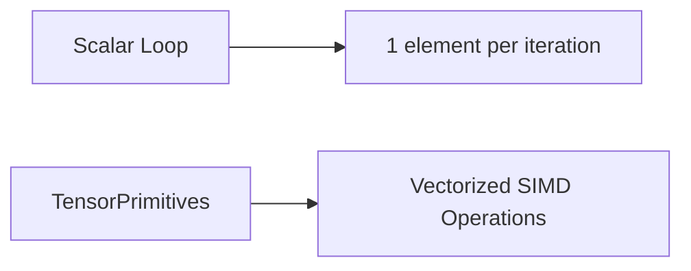
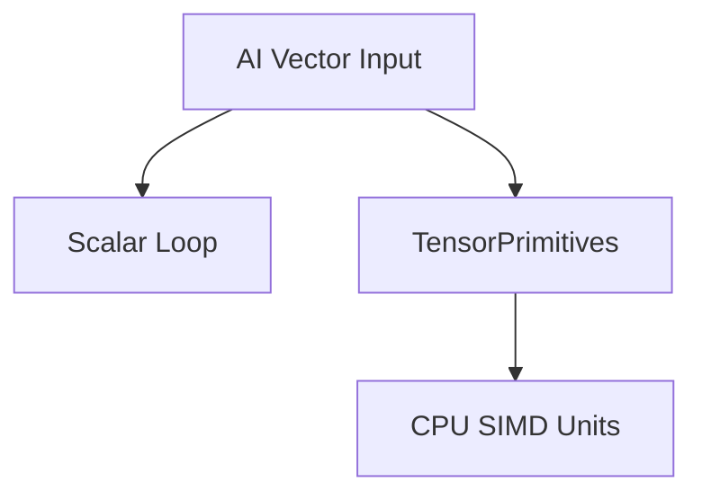

# AI-Question02 - .NET 8 introduced the System.Numerics.Tensors namespace. How do TensorPrimitives improve the performance of AI operations like dot products or cosine similarity compared to standard foreach loops?

`System.Numerics.Tensors` and especially `TensorPrimitives` in .NET 8 are designed to leverage **vectorized CPU instructions (SIMD)** to accelerate numeric workloads such as:

* Dot products
* Cosine similarity
* Element-wise operations
* Reductions (sum, max, etc.)

The key improvement comes from **data-level parallelism**.

---

# The Core Idea: SIMD vs Scalar Loops

## Traditional `foreach` (Scalar Execution)

A standard loop processes **one element at a time**.

```csharp
double DotProduct(double[] a, double[] b)
{
    double sum = 0;

    for (int i = 0; i < a.Length; i++)
    {
        sum += a[i] * b[i];
    }

    return sum;
}
```

This executes:

* One multiply
* One add
* Per iteration
* Using scalar CPU registers

Even if the CPU has 512-bit vector units, this code does not use them.

---

## TensorPrimitives (SIMD Vectorization)

`TensorPrimitives` internally uses:

* `System.Runtime.Intrinsics`
* Hardware SIMD instructions (AVX, AVX2, AVX-512 where available)
* Vectorized memory operations
* Loop unrolling
* Fused multiply-add (FMA) when supported

Example:

```csharp
using System.Numerics.Tensors;

double dot = TensorPrimitives.Dot(a, b);
```

That single call:

* Processes multiple elements per CPU instruction
* Uses vector registers
* Minimizes loop overhead
* Reduces branching
* Optimizes memory throughput

---

# What Actually Happens Under the Hood

### Conceptual Difference



---

### SIMD Execution Model

If the CPU supports 256-bit AVX:

* 4 doubles processed at once (4 × 64-bit)
* Instead of 1 at a time

If using 512-bit:

* 8 doubles at once

This is **true parallel execution inside a single core**.

---

# Why This Is Faster

## 1. Fewer Loop Iterations

Instead of:

```
N iterations
```

You get:

```
N / VectorWidth iterations
```

That alone reduces overhead dramatically.

---

## 2. Reduced Instruction Count

A scalar loop may require:

* Load
* Multiply
* Add
* Store
* Branch
* Index increment

TensorPrimitives replaces many of these with:

* Vector load
* Vector multiply
* Vector accumulate
* Single loop control

---

## 3. Hardware Fused Multiply-Add (FMA)

On supported CPUs:

```
a * b + c
```

Can execute as **one instruction**, not two.

This improves both:

* Speed
* Floating-point accuracy

---

## 4. Better Memory Throughput

SIMD:

* Uses aligned vector loads
* Reduces instruction overhead
* Improves cache utilization
* Reduces branch misprediction

For large tensors, performance becomes **memory-bandwidth bound**, and SIMD helps saturate bandwidth efficiently.

---

# Dot Product Comparison

### Traditional Loop

```csharp
double Dot(double[] a, double[] b)
{
    double sum = 0;

    for (int i = 0; i < a.Length; i++)
        sum += a[i] * b[i];

    return sum;
}
```

### TensorPrimitives

```csharp
double dot = TensorPrimitives.Dot(a, b);
```

The second version:

* Uses vectorized accumulation
* Uses optimized reduction strategies
* Avoids manual branching
* Is architecture-aware

---

# Cosine Similarity Example

Cosine similarity:

[
\frac{A \cdot B}{||A|| , ||B||}
]

Using TensorPrimitives:

```csharp
using System.Numerics.Tensors;

double dot = TensorPrimitives.Dot(a, b);
double normA = TensorPrimitives.Norm(a);
double normB = TensorPrimitives.Norm(b);

double cosine = dot / (normA * normB);
```

Each operation:

* Is vectorized
* Avoids manual summation loops
* Uses optimized reduction paths

---

# Why This Matters for AI Workloads

AI workloads often involve:

* Embeddings
* Matrix math
* Vector similarity search
* Feature normalization
* Linear algebra primitives

These operations are:

* Highly repetitive
* Numeric-heavy
* Parallelizable at the data level

TensorPrimitives is optimized for exactly this pattern.

---

# Performance Characteristics

Compared to `foreach`:

| Aspect                   | Scalar Loop | TensorPrimitives     |
| ------------------------ | ----------- | -------------------- |
| Parallelism              | None        | SIMD                 |
| CPU Utilization          | Low         | High                 |
| Instructions per element | High        | Low                  |
| Memory efficiency        | Moderate    | Optimized            |
| Branching                | Present     | Minimal              |
| Throughput               | Lower       | Significantly higher |

---

# Architectural View



TensorPrimitives maps high-level tensor operations directly to hardware vector units.

---

# Important Reality Check

TensorPrimitives improves performance **when:**

* Arrays are large enough to benefit from vectorization
* Data is contiguous in memory
* The workload is numeric (not control-heavy)

For very small arrays, the overhead may not matter much.

But for:

* Embedding similarity
* Search ranking
* ML feature processing
* Large-scale inference pipelines

The performance gain can be substantial.

---

# Why This Is Better Than Writing SIMD Manually

You could use:

* `System.Runtime.Intrinsics`
* AVX2 directly
* Vector<T>

But that requires:

* Architecture-specific code
* Complex fallbacks
* Maintenance burden

TensorPrimitives:

* Automatically adapts to hardware
* Uses optimal instruction sets
* Is cross-platform
* Is maintained by the .NET runtime team

---

# Summary

`TensorPrimitives` improves AI operation performance over standard `foreach` loops because it:

* Uses SIMD vector instructions
* Processes multiple elements per CPU cycle
* Reduces branching and loop overhead
* Utilizes hardware FMA when available
* Improves memory throughput
* Automatically adapts to CPU capabilities

In short:

> Scalar loops use one lane of the CPU.
> TensorPrimitives uses all lanes available.
