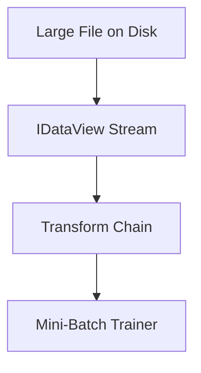

# AI-Question 03 - Explain the purpose of IDataView in ML.NET. How does it handle large datasets that exceed the available RAM?

`IDataView` is the **core data abstraction** in ML.NET.

Its purpose is to provide a **highly efficient, schema-aware, streaming data pipeline** that supports:

* Large datasets
* Lazy evaluation
* Columnar processing
* Composable transforms
* Out-of-memory workflows

It is *not* a `DataTable` replacement and it is *not* an in-memory collection. It is a **deferred execution data pipeline contract**.

---

# What Problem Does `IDataView` Solve?

Machine learning workloads often involve:

* Millions to billions of rows
* Feature engineering pipelines
* Streaming data
* Files too large for RAM

Traditional approaches (like loading everything into memory) fail when:

```
Dataset size > Available RAM
```

`IDataView` solves this by being:

* **Lazy**
* **Streaming**
* **Column-oriented**
* **Composable**
* **Memory-efficient**

---

# Conceptual Architecture


`IDataView` sits between data sources and ML algorithms.

---

# Key Design Principles

## 1. Lazy Evaluation

Nothing is executed until data is requested.

Transforms are:

* Defined upfront
* Executed only when enumerated
* Chained efficiently

This avoids unnecessary memory allocation.

---

## 2. Streaming Data Access

`IDataView` reads data in a **row-by-row streaming fashion**.

It does not require loading the entire dataset into memory.

Example:

```csharp
using Microsoft.ML;

var mlContext = new MLContext();

IDataView data = mlContext.Data.LoadFromTextFile<ModelInput>(
    "large-dataset.csv",
    hasHeader: true,
    separatorChar: ',');
```

This does **not** load all rows into RAM at once.

It creates a streaming pipeline over the file.

---

## 3. Column-Oriented Design

Internally, ML.NET processes data **by columns**, not rows.

This improves:

* Cache efficiency
* Vectorization
* Transform performance
* Memory locality

This is critical for large-scale ML pipelines.

---

## 4. Composable Transform Pipeline

Transforms do not immediately modify data.

Instead, they build a pipeline:

```csharp
var pipeline =
    mlContext.Transforms.Concatenate("Features", "Feature1", "Feature2")
    .Append(mlContext.Regression.Trainers.Sdca());

var model = pipeline.Fit(data);
```

Each transform:

* Wraps the previous `IDataView`
* Adds processing logic
* Maintains laziness

This creates a **pipeline graph**, not a copied dataset.

---

# How It Handles Datasets Larger Than RAM

This is the critical part.

`IDataView` handles large datasets through:

---

## 1. Streaming Enumeration

When training begins:

* Data is read in batches
* Only active batch data is in memory
* Previous rows are discarded
* No full dataset copy is created

The trainer requests data incrementally.

---

## 2. On-Demand Row Materialization

Rows are:

* Retrieved only when needed
* Represented via lightweight column readers
* Not stored as full objects

This avoids object allocation overhead.

---

## 3. Efficient File Readers

For example:

```csharp
mlContext.Data.LoadFromTextFile(...)
```

Uses optimized file readers that:

* Stream from disk
* Parse incrementally
* Avoid buffering the entire file

---

## 4. Batch Processing in Trainers

Many ML.NET trainers operate on:

* Mini-batches
* Streaming passes
* Iterative optimization algorithms

This means they can:

* Process huge datasets
* Without loading them entirely into RAM

---

## 5. Zero-Copy Transform Chains

Transforms typically:

* Reference input data
* Produce logical views
* Avoid duplicating storage

This keeps memory usage stable even with large pipelines.

---

# Memory Behavior Model



At no point is the full dataset required in memory.

---

# Example: Training on a Large Dataset

```csharp
var data = mlContext.Data.LoadFromTextFile<ModelInput>(
    "huge-data.csv",
    hasHeader: true,
    separatorChar: ',');

var pipeline =
    mlContext.Transforms.Concatenate("Features", "Feature1", "Feature2")
    .Append(mlContext.Regression.Trainers.Sdca());

var model = pipeline.Fit(data);
```

Even if the file is:

* Several GBs
* Or larger

The pipeline remains memory-efficient.

---

# Why This Is Different From Using Lists or DataTables

If you used:

```csharp
List<ModelInput>
```

You would:

* Load everything into RAM
* Duplicate storage
* Increase GC pressure
* Risk OutOfMemoryException

`IDataView` avoids that by design.

---

# Key Advantages of IDataView

| Feature              | Benefit                     |
| -------------------- | --------------------------- |
| Lazy execution       | No premature loading        |
| Streaming            | Handles massive datasets    |
| Columnar design      | Efficient transforms        |
| Composable pipelines | Clean ML workflows          |
| Low memory footprint | Scales beyond RAM           |
| Trainer integration  | Optimized for ML algorithms |

---

# Important Clarification

`IDataView` is:

* Not a materialized dataset
* Not automatically cached
* Not a `DataFrame`
* Not an in-memory collection

It is a **contract for structured, lazy data access**.

---

# When It Does Load Into Memory

If you explicitly:

* Call `.ToList()`
* Use `.Preview()`
* Or materialize results

Then data will be loaded.

But by default, it is streaming.

---

# Summary

`IDataView` in ML.NET:

* Is the core abstraction for ML data pipelines
* Enables lazy, streaming access to data
* Avoids full in-memory loading
* Supports datasets larger than available RAM
* Uses column-oriented processing
* Enables efficient transform chaining
* Works with batch-based trainers

It is designed specifically to allow:

> Large-scale machine learning in constrained memory environments.
