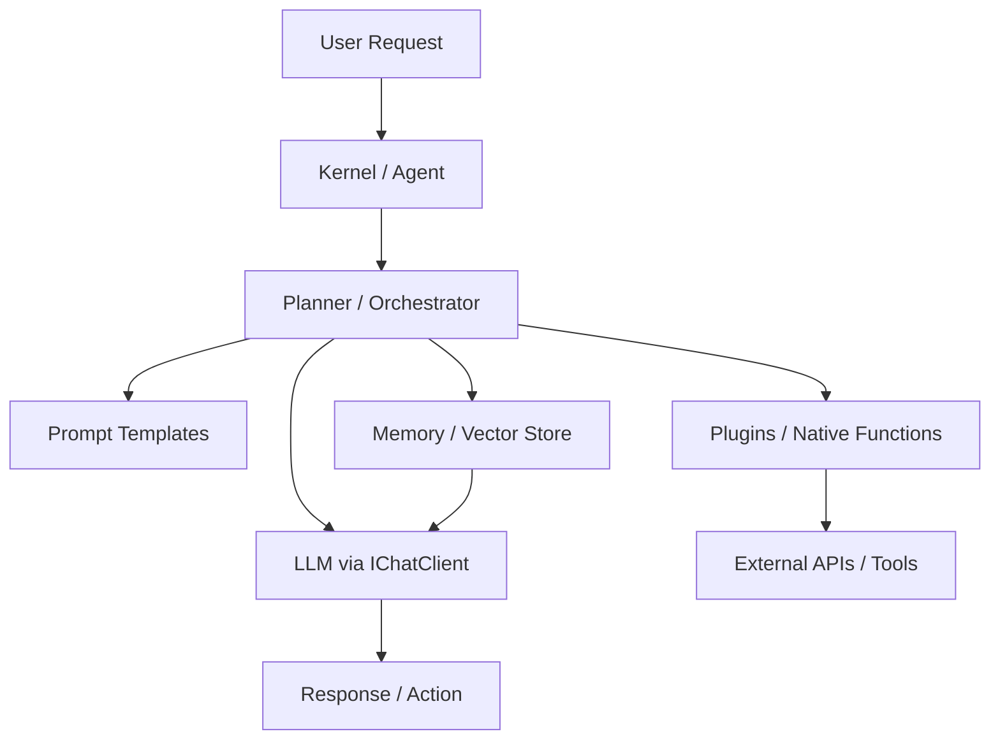
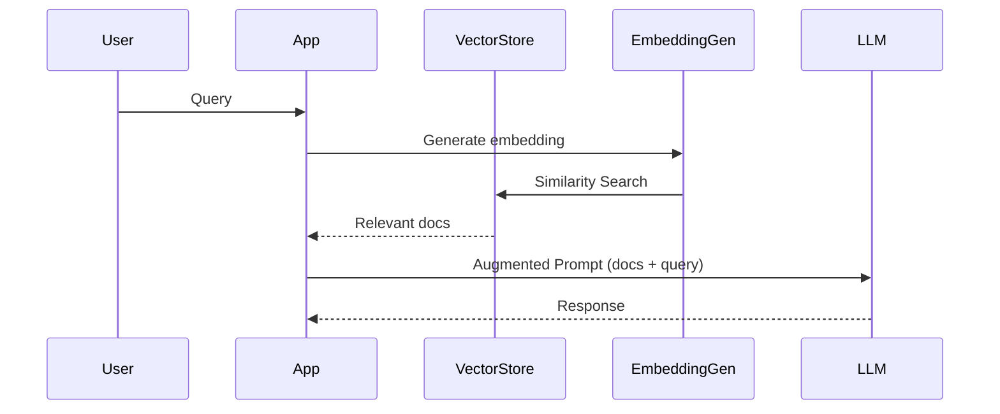
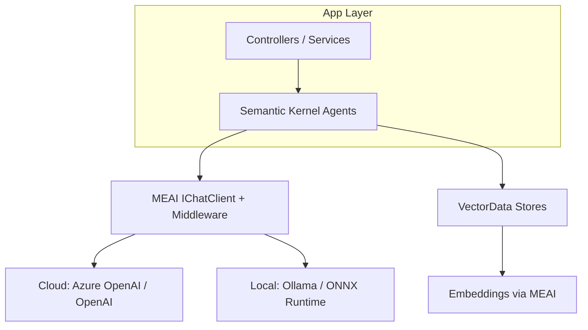

# AI-Question04 - Beyond ML.NET, which libraries (e.g., Semantic Kernel, ONNX Runtime, or Microsoft.Extensions.AI) are essential for building a generative AI application in C# today?

**Microsoft.Extensions.AI (MEAI), Semantic Kernel (SK), Microsoft.Extensions.VectorData, and ONNX Runtime GenAI** form the core modern stack for building generative AI applications in C#/.NET beyond ML.NET. These are backed by official Microsoft documentation, .NET blogs, and NuGet ecosystems as of 2026.

They emphasize **abstractions** for provider-agnostic code, orchestration for agents/plugins, vector stores for RAG, and efficient local/cloud inference. This ecosystem matured significantly by 2025–2026, with MEAI providing low-level building blocks (inspired by and integrated with SK patterns) and SK handling higher-level agentic workflows.

### 1. Microsoft.Extensions.AI (MEAI) – Foundational Abstractions
This is the **unified, idiomatic .NET layer** for LLMs, embeddings, tool calling, telemetry, caching, and middleware (DI, builders, pipelines). It uses `IChatClient` and `IEmbeddingGenerator<TInput, TEmbedding>` as exchange types, enabling seamless swapping of providers (OpenAI, Azure, Ollama, etc.) without code changes.

Most apps reference `Microsoft.Extensions.AI` (which pulls Abstractions) plus provider packages. It powers interoperability across the ecosystem, including Semantic Kernel.

**Example (basic chat with middleware support):**
```csharp
using Microsoft.Extensions.AI;
using Microsoft.Extensions.DependencyInjection;

// In Program.cs or Startup
var services = new ServiceCollection();
services.AddChatClient(new OpenAIChatClient("gpt-4o-mini", apiKey))  // or Azure, Ollama, etc.
    .UseOpenTelemetry()  // or caching, logging, retry middleware
    .UseFunctionInvocation();  // automatic tool calling

var kernel = services.BuildServiceProvider();
var chatClient = kernel.GetRequiredService<IChatClient>();

var response = await chatClient.GetResponseAsync("Explain .NET AI stack");
Console.WriteLine(response.Message);
```

Provider examples: `Microsoft.Extensions.AI.OpenAI`, `Microsoft.Extensions.AI.Ollama`, `Microsoft.Extensions.AI.AzureAIInference`, etc.

### 2. Semantic Kernel – Orchestration and Agents
**Semantic Kernel** builds on MEAI abstractions for higher-level features: prompts, plugins (native functions), memories, planners, and multi-agent workflows. It excels at agentic applications, RAG, and business process automation. Use it when you need orchestration beyond raw chat.

SK integrates natively with MEAI primitives and supports C#, Python, and Java. Key for production agents.

**Architecture Overview (Mermaid):**


**Basic SK Example:**
```csharp
using Microsoft.SemanticKernel;

var builder = Kernel.CreateBuilder();
builder.AddAzureOpenAIChatCompletion(modelId, endpoint, apiKey);  // or OpenAI, Ollama via connectors
// builder.Services.AddChatClient(...) for MEAI integration

var kernel = builder.Build();

// Add a native plugin
kernel.ImportPluginFromType<TimePlugin>();  // e.g., custom C# functions

// Invoke
var result = await kernel.InvokePromptAsync("What time is it in UTC? Use tools if needed.");
```

For agents: Use the Semantic Kernel Agent Framework for multi-agent patterns.

### 3. Microsoft.Extensions.VectorData – RAG and Semantic Memory
Essential for **retrieval-augmented generation** (RAG). Provides abstractions for vector stores (InMemory, Redis, Qdrant, etc.) with attributes for mapping .NET types, similarity search, filtering, and hybrid search.

Integrates with embeddings from MEAI and SK memory.

**Mermaid: RAG Flow**


**Example Mapping:**
```csharp
using Microsoft.Extensions.VectorData;

public class Product
{
    [VectorStoreKey] public int Id { get; set; }
    [VectorStoreData(IsIndexed = true)] public string Name { get; set; }
    [VectorStoreVector(Dimensions: 1536)] public ReadOnlyMemory<float> Embedding { get; set; }
}

// Usage with provider (e.g., Redis)
var vectorStore = services.AddRedisVectorStore(...);
var collection = vectorStore.GetCollection<int, Product>("products");
await collection.CreateCollectionIfNotExistsAsync();
```

### 4. ONNX Runtime (GenAI) – Local/Optimized Inference
Critical for **running models locally or on-device** with high performance (CPU, GPU, accelerators). ONNX Runtime GenAI handles the generative loop for LLMs (pre/post-processing, KV cache, sampling). Excellent for privacy, cost, or edge scenarios.

**Basic GenAI Example (C# API):**
```csharp
using Microsoft.ML.OnnxRuntimeGenAI;

// Load model (e.g., Phi-3, Llama ONNX export)
using var model = new Model("path/to/onnx/model");
using var tokenizer = new Tokenizer(model);
using var generator = new Generator(model, new GeneratorParams { /* config */ });

var sequences = generator.Generate(/* tokens */);  // or use GenerateAsync
```

Combine with MEAI/SK for hybrid cloud + local fallbacks.

### Other Valuable Libraries
- **Provider SDKs**: `Azure.AI.OpenAI`, community OpenAI .NET clients.
- **TorchSharp**: For custom deep learning/training (PyTorch bindings). Useful for research or non-LLM models, but less essential for standard generative apps than the above.
- **AutoGen.NET / LangChain.NET**: For advanced multi-agent if SK's framework isn't sufficient.

### Recommended Stack for a Typical Generative AI App (2026)
1. **MEAI** → core clients + middleware.
2. **Semantic Kernel** → orchestration/agents (on top of MEAI).
3. **VectorData** → RAG/memory.
4. **ONNX Runtime GenAI** → local inference.
5. Connectors for specific stores/models.

**High-level Architecture (Mermaid):**


This setup is **provider-agnostic, testable, observable, and scalable**. Start with official Microsoft Learn docs for MEAI and SK quickstarts, then layer in vector stores and local runtimes. The ecosystem prioritizes enterprise patterns (DI, middleware, abstractions) while supporting rapid prototyping. Always validate token usage, costs, and safety in production.