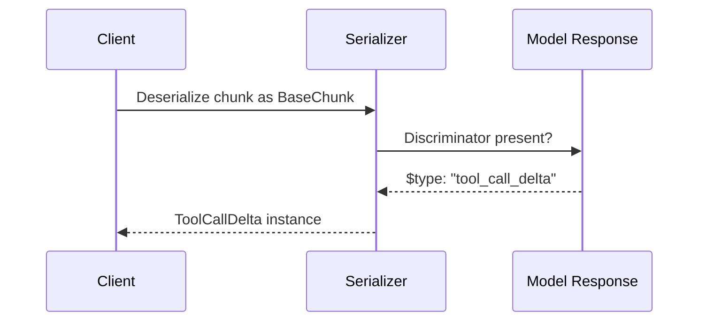

# AI-Question05 - How does System.Text.Json polymorphism support the handling of varied AI model responses (like different "tool calls" or "finish reasons")?

**System.Text.Json polymorphism**, introduced with robust attribute-based support in .NET 7 (and refined in later versions), is essential for handling the varied, dynamic structures in generative AI model responses. These responses often include heterogeneous elements like different tool call types, varying finish reasons, content parts (text vs. tool calls), or provider-specific extensions.

### Core Mechanism: [JsonPolymorphic] + [JsonDerivedType]
- **`[JsonPolymorphic]`** on a base type enables polymorphic (de)serialization and configures options (e.g., discriminator property name, unknown type handling).
- **`[JsonDerivedType]`** registers concrete derived types with optional type discriminators (string or int). The serializer injects a discriminator (default `$type`) during serialization and uses it for type resolution during deserialization.

This avoids manual type-checking, custom `JsonConverter<T>` boilerplate (pre-.NET 7), or `object`/`JsonElement` fallbacks, enabling strongly-typed, maintainable code for AI SDKs.

**Mermaid: Polymorphic Deserialization Flow**
```mermaid
flowchart TD
    A[Incoming JSON Response] --> B[JsonSerializer.Deserialize<BaseType>]
    B --> C{Read Discriminator?}
    C -->|"$type": "toolCall"| D[Resolve to ToolCallContent]
    C -->|"$type": "text"| E[Resolve to TextContent]
    C -->|Unknown| F[UnknownDerivedTypeHandling: Fallback / Fail / Skip]
    D --> G[Strongly-typed Derived Instance]
    E --> G
```

### Application to AI Model Responses
AI APIs (OpenAI, Azure, Ollama, etc.) return responses with:
- **Tool calls**: Function calls, parallel tools, or different formats.
- **Finish reasons**: `"stop"`, `"tool_calls"`, `"length"`, `"content_filter"`, etc.
- **Content parts**: Mixed text + tool calls in streaming or multi-modal responses.
- **Provider variations**: Different structures across models/providers.

#### 1. Example: Polymorphic Content (e.g., Microsoft.Extensions.AI)
`Microsoft.Extensions.AI` uses this pattern for `AIContent` to unify content across providers.

```csharp
using System.Text.Json.Serialization;

[JsonPolymorphic(TypeDiscriminatorPropertyName = "$type")]
[JsonDerivedType(typeof(TextContent), "text")]
[JsonDerivedType(typeof(ToolCallContent), "toolCall")]
// Add more: ImageContent, etc.
public abstract class AIContent
{
    public string? Text { get; set; } // Common properties
}

public class TextContent : AIContent { /* specific props */ }

public class ToolCallContent : AIContent
{
    public string ToolCallId { get; set; } = string.Empty;
    public string Name { get; set; } = string.Empty;
    public string Arguments { get; set; } = string.Empty;
}
```

**Usage in Response Handling:**
```csharp
var response = await chatClient.GetResponseAsync(...);
foreach (var content in response.Message.Contents)  // List<AIContent>
{
    if (content is ToolCallContent toolCall)
    {
        // Handle tool invocation strongly-typed
        await InvokeToolAsync(toolCall.Name, toolCall.Arguments);
    }
    else if (content is TextContent text)
    {
        Console.WriteLine(text.Text);
    }
}
```

This cleanly handles varied responses without `switch` on raw JSON.

#### 2. Tool Calls Polymorphism
Tool calls often vary (function vs. other types, or parallel calls). Model as a hierarchy:

```csharp
[JsonPolymorphic(TypeDiscriminatorPropertyName = "type")]
[JsonDerivedType(typeof(FunctionToolCall), "function")]
public abstract class ToolCall
{
    public string Id { get; set; } = string.Empty;
}

public class FunctionToolCall : ToolCall
{
    public FunctionCall Function { get; set; } = new();
}

public class FunctionCall
{
    public string Name { get; set; } = string.Empty;
    public string Arguments { get; set; } = string.Empty;  // JSON string or object
}
```

In SDK response models (e.g., `ChatCompletion` or `ChatMessage`), a `List<ToolCall>` or `IList<AIContent>` leverages this. Deserialization automatically materializes the correct derived type based on the discriminator.

#### 3. Finish Reasons and Variant Responses
Finish reasons are often enums, but response objects can be polymorphic for different completion variants:

```csharp
[JsonPolymorphic]
[JsonDerivedType(typeof(StopCompletion), "stop")]
[JsonDerivedType(typeof(ToolCallsCompletion), "tool_calls")]
public abstract class CompletionResult { /* common */ }

public class StopCompletion : CompletionResult { public string Reason { get; set; } = "stop"; }

public class ToolCallsCompletion : CompletionResult
{
    public List<ToolCall> ToolCalls { get; set; } = new();
}
```

**Streaming Example (Mermaid):**


### Advanced Configuration
- **Custom Discriminator**: `[JsonPolymorphic(TypeDiscriminatorPropertyName = "objectType")]`.
- **Unknown Types**: `[JsonPolymorphic(UnknownDerivedTypeHandling = JsonUnknownDerivedTypeHandling.FallBackToNearestAncestor)]` or `JsonUnknownDerivedTypeHandling.Skip`.
- **Contract Model** (for third-party types): Use `JsonTypeInfoResolver` / `DefaultJsonTypeInfoResolver` modifiers for runtime polymorphism config.
- **Performance**: Attributes are efficient; combine with source generation (`JsonSerializerContext`).

### Benefits in Generative AI Apps
- **Provider Agnosticism** (MEAI/Semantic Kernel): Swap OpenAI ↔ Azure ↔ local without changing handling code.
- **Streaming & Agents**: Handle partial tool calls, deltas, or multi-turn responses cleanly.
- **Safety & Maintainability**: Strongly-typed objects reduce runtime errors vs. `JsonElement` parsing.
- **Extensibility**: Easily add new derived types for new model capabilities (e.g., vision content, reasoning traces).

This approach is used extensively in modern .NET AI libraries (Microsoft.Extensions.AI, Azure.AI.OpenAI, Semantic Kernel) for robust, idiomatic handling of non-uniform AI outputs. For full details, refer to the official Microsoft documentation on polymorphic serialization. Always test with real model outputs, as schemas can evolve.