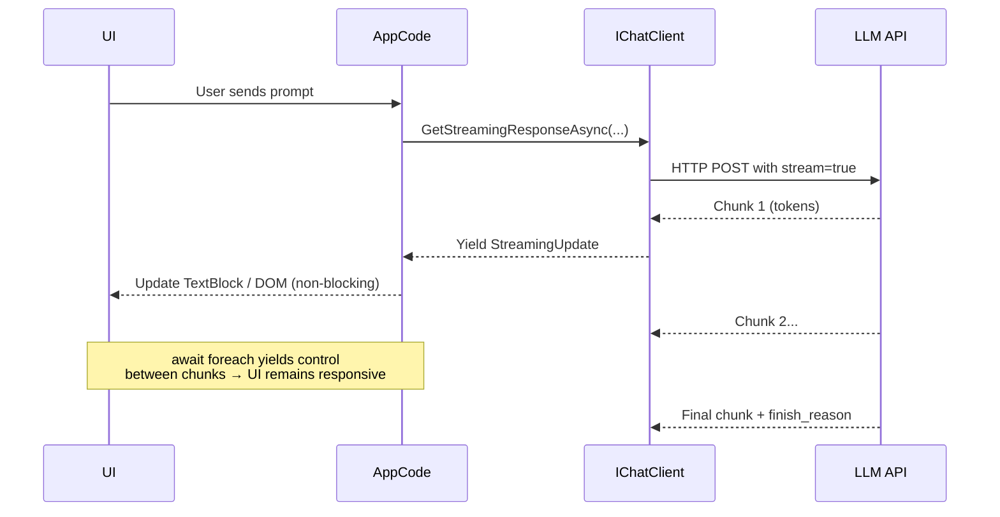

# AI-Question 06 - Explain how IAsyncEnumerable<T> is utilized when consuming streaming tokens from a Large Language Model (LLM) API to maintain UI responsiveness

**`IAsyncEnumerable<T>`** is the idiomatic, efficient way in modern .NET to consume streaming tokens from LLM APIs (via Microsoft.Extensions.AI, Semantic Kernel, Azure OpenAI, Ollama, etc.). It enables **incremental processing** of partial responses (tokens, deltas, or updates) without waiting for the full completion, which directly prevents UI thread blocking and keeps applications responsive.

### Why IAsyncEnumerable for LLM Streaming?
LLM providers return responses as a sequence of chunks over HTTP (Server-Sent Events or chunked transfer). Each chunk contains one or more new tokens, usage metadata, finish reasons, tool call deltas, etc.

- **`IAsyncEnumerable<T>`** (C# 8+, .NET Core 3+) models this as an asynchronous pull-based stream.
- `await foreach` iterates asynchronously, yielding control back to the caller (UI message pump, ASP.NET pipeline, etc.) between chunks.
- No full buffering in memory → lower latency and memory usage.
- Natural integration with `CancellationToken` for stopping generation.

This contrasts with a single `Task<ChatCompletion>` (non-streaming), which blocks until the entire response arrives.

**Streaming Flow**


### Core Usage in Microsoft.Extensions.AI (Recommended Foundation)
```csharp
using Microsoft.Extensions.AI;

// In a service or ViewModel
public async Task StreamResponseAsync(string userPrompt, ChatHistory history)
{
    history.Add(new ChatMessage(ChatRole.User, userPrompt));

    // Returns IAsyncEnumerable<StreamingChatCompletionUpdate> or similar
    await foreach (var update in _chatClient.GetStreamingResponseAsync(history))
    {
        // Process each incremental update (tokens arrive every ~50-200ms)
        if (!string.IsNullOrEmpty(update.Text))
        {
            // Append to UI-bound property (e.g., ObservableCollection or StringBuilder)
            _responseText += update.Text;
            // In WPF/MAUI/WinUI: Dispatcher.Invoke or use BindableProperty
            OnPropertyChanged(nameof(ResponseText)); // For MVVM
        }

        // Handle other update types: tool call deltas, usage, finish reason
        if (update.FinishReason != null)
        {
            Console.WriteLine($"Finished with: {update.FinishReason}");
        }
    }

    // After stream ends, add final assistant message to history
    history.Add(new ChatMessage(ChatRole.Assistant, _responseText));
}
```

**In a Blazor Component (Server or WebAssembly):**
```razor
@code {
    private string _response = string.Empty;

    private async Task SendMessage()
    {
        await foreach (var update in chatClient.GetStreamingResponseAsync(messages))
        {
            _response += update.Text ?? string.Empty;
            StateHasChanged(); // Triggers UI re-render with new tokens
        }
    }
}
```

### Semantic Kernel Streaming
SK builds on the same pattern (often wrapping MEAI or provider connectors):

```csharp
IAsyncEnumerable<StreamingChatMessageContent> stream = 
    kernel.InvokeStreamingAsync("Tell me a story...");

await foreach (var content in stream)
{
    Console.Write(content.Content); // Incremental token
    // Update UI here
}
```

### UI Responsiveness Benefits
- **Non-blocking iteration**: The `await` in `await foreach` releases the synchronization context (UI thread) between chunks. The message loop continues processing clicks, renders, etc.
- **Progressive UI updates**: Text appears character-by-character (like ChatGPT), improving perceived performance.
- **Cancellation support**:
  ```csharp
  await foreach (var update in client.GetStreamingResponseAsync(..., cancellationToken))
  {
      // User clicked "Stop" → token propagates to LLM provider
  }
  ```
- **Backpressure & efficiency**: Consumer controls pace; no need to buffer entire response.
- **Composable**: Can be transformed with LINQ (`Where`, `Select`, `TakeWhile`) or combined with `Channels`, Rx, etc.

**Mermaid: Thread/UI Behavior**

```mermaid
gantt
    title Streaming vs Non-Streaming Impact on UI Thread
    dateFormat  s
    axisFormat %S
    section Non-Streaming
    Full Response Wait :active, 0, 8s
    UI Frozen         :crit, 0, 8s
    section IAsyncEnumerable Streaming
    Chunk 1 :active, 0, 0.2s
    UI Responsive     : 0.2, 1.8s
    Chunk 2           :active, 2, 0.2s
    UI Responsive     : 2.2, 1.8s
    ...               : 4, 4s
```


### Advanced Patterns
- **Accumulation with tool calls**: Check `update.ToolCalls` deltas and invoke functions mid-stream when complete.
- **ASP.NET Minimal API streaming**: Return `IAsyncEnumerable<T>` directly from an endpoint for NDJSON or Server-Sent Events to the frontend.
- **Error handling**: Use `try` inside the loop or wrap the enumerator.
- **Hybrid**: Combine with `Microsoft.Extensions.VectorData` for RAG while streaming.

This pattern is the foundation of responsive AI UIs in .NET today (MEAI + SK). It leverages the language/runtime's async streams support for clean, scalable, real-time generative experiences. For production, always handle `CancellationToken`, telemetry (via MEAI middleware), and partial content safely. Refer to official Microsoft Learn docs for `IChatClient` and Semantic Kernel streaming examples.