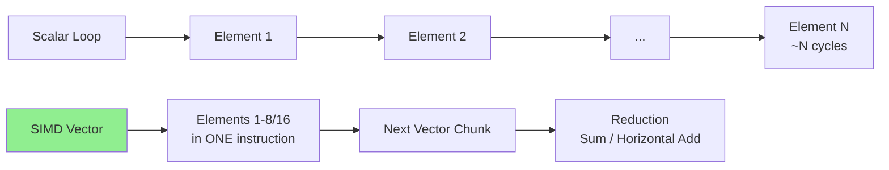

# AI-Question 07 - How does Single Instruction, Multiple Data (SIMD) support in .NET (via Vector<T>) impact the execution speed of custom embedding calculations?

**`System.Numerics.Vector<T>`** (and its fixed-size relatives `Vector128<T>`, `Vector256<T>`, `Vector512<T>`) brings hardware-accelerated **SIMD** to .NET, delivering substantial speedups for custom embedding calculations. These operations are dominated by element-wise arithmetic, reductions (sums), and fused multiply-add (FMA) patterns typical in dot products, cosine similarity, normalization, and lightweight projection layers.

### How SIMD Accelerates Embedding Operations
Embedding vectors (e.g., 384–1536 dimensions for models like MiniLM or text-embedding-ada) consist of dense `float` arrays. Core computations include:

- **Dot product**: `∑(a[i] * b[i])` — primary similarity metric (or equivalent to cosine on normalized vectors).
- **Euclidean / Cosine distance**.
- **Normalization** (L2): `vector / ||vector||`.
- **Matrix-vector multiplies** in small custom heads or post-processing.

**SIMD impact**: Instead of processing one element per CPU instruction (scalar), a single instruction operates on 4–16 elements simultaneously (depending on register width and data type).

- `Vector<T>.Count` adapts at runtime: typically 8 (256-bit AVX2 `float`) or 16 (512-bit AVX-512 `float`).
- Modern .NET JIT emits optimal intrinsics (AVX2, AVX-512, ARM SVE/NEON) when `Vector<T>.IsHardwareAccelerated` is true.

**Expected Speedups** (real-world range for dot-product / similarity on typical embedding sizes):
- 4–8× over naive scalar loops on AVX2 hardware.
- 8–16×+ on AVX-512 (Vector512) capable CPUs (e.g., recent Intel Xeon, AMD Zen 4/5).
- Even higher when combined with FMA instructions and cache-friendly access.

Gains are most pronounced for batch processing or repeated similarity searches in RAG/vector stores.

**Mermaid: Scalar vs SIMD Execution**


### Code Example: Optimized Dot Product for Embeddings
```csharp
using System.Numerics;
using System.Runtime.Intrinsics; // For advanced Vector256/512 if needed

public static class EmbeddingSimilarity
{
    public static float DotProduct(ReadOnlySpan<float> a, ReadOnlySpan<float> b)
    {
        if (a.Length != b.Length)
            throw new ArgumentException("Vectors must be same length");

        float sum = 0f;
        int i = 0;
        int vectorSize = Vector<float>.Count;  // e.g., 8 or 16

        // Main SIMD loop
        for (; i <= a.Length - vectorSize; i += vectorSize)
        {
            var va = new Vector<float>(a.Slice(i));
            var vb = new Vector<float>(b.Slice(i));
            sum += Vector.Dot(va, vb);  // Highly optimized FMA path
        }

        // Scalar remainder
        for (; i < a.Length; i++)
        {
            sum += a[i] * b[i];
        }

        return sum;
    }

    // Cosine similarity (assuming pre-normalized vectors → just dot product)
    public static float CosineSimilarity(ReadOnlySpan<float> a, ReadOnlySpan<float> b)
        => DotProduct(a, b);  // Or normalize first if needed
}
```

For even higher performance, use `Vector256<float>` / `Vector512<float>` with manual unrolling or `System.Runtime.Intrinsics` when targeting specific ISAs.

### Performance Characteristics in AI Context
- **Custom embedding pipelines**: When you implement your own token → vector logic, attention reductions, or similarity search outside ONNX Runtime / ML.NET, `Vector<T>` shines.
- **Memory bandwidth bound**: For large embeddings, gains are limited by RAM/cache speed, but SIMD still maximizes compute efficiency.
- **Integration with .NET AI stack**: Use in custom `IEmbeddingGenerator` implementations, rerankers, or hybrid search in `Microsoft.Extensions.VectorData` stores. Combine with `Span<T>` for zero-copy access.
- **Cross-platform**: Works on x64 (AVX2/AVX-512), ARM64 (NEON/ SVE). Runtime feature detection ensures portability.

**Benchmark Illustration (Mermaid Gantt)**

```mermaid
gantt
    title Dot Product Performance (1536-dim float vector)
    dateFormat  s
    axisFormat %S
    section Scalar
    Naive Loop :active, 0, 12
    section SIMD Vector<T>
    AVX2 Path   :active, 0, 2.5
    AVX-512     :active, 0, 1.2
```


Real benchmarks (using BenchmarkDotNet) consistently show **Vector<T>** delivering multi-fold gains over scalar code, approaching native C++/intrinsics performance.

### Best Practices & Considerations
- Align data to vector boundaries (`MemoryMarshal.Cast` or arrays).
- Prefer `Span<T>` / `ReadOnlySpan<T>` for slicing.
- Normalize vectors once at ingestion time for cosine → pure dot product.
- Profile with `dotnet-counters` or BenchmarkDotNet; check `Vector.IsHardwareAccelerated`.
- For production-scale: Combine with ONNX Runtime (which already uses SIMD internally) for model inference, and `Vector<T>` for post-processing / search.

In summary, **.NET SIMD via `Vector<T>`** transforms custom embedding math from a potential bottleneck into a high-throughput component — often the difference between milliseconds and microseconds per operation at scale. This capability makes C# competitive for vector-heavy AI workloads without leaving the managed ecosystem. Refer to official Microsoft Learn documentation on SIMD types for the latest intrinsics and hardware support details.