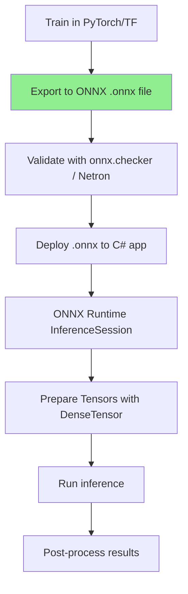

# AI-Question08 - Describe the process of exporting a model from PyTorch/TensorFlow to ONNX and consuming it in C#. Why is ONNX often preferred for cross-platform C# AI deployments?

**Exporting a model from PyTorch or TensorFlow to ONNX**, then consuming it with **ONNX Runtime** in C#, is the standard, production-grade path for bringing Python-trained models into the .NET ecosystem. This process leverages ONNX as an interoperable intermediate format.

### Step-by-Step: Exporting from PyTorch to ONNX
1. **Train or load your model** in PyTorch.
2. **Prepare a dummy input** matching the expected tensor shape(s).
3. **Export** using `torch.onnx.export` (or the newer `torch.onnx.dynamo_export` for PyTorch 2.x+).

**Example (PyTorch):**
```python
import torch
import torch.onnx

# Load or define model (must be in eval mode)
model = YourModel()
model.eval()

# Example input (batch_size=1, adjust to your model's input)
dummy_input = torch.randn(1, 3, 224, 224)

torch.onnx.export(
    model,                     # Model to export
    dummy_input,               # Example input(s) - tuple for multiple
    "model.onnx",              # Output file
    export_params=True,        # Store trained weights
    opset_version=17,          # Higher = more operators supported (17-19 common in 2026)
    do_constant_folding=True,  # Optimize constants
    input_names=['input'],     # Optional: name inputs/outputs
    output_names=['output'],
    dynamic_axes={             # For variable batch/size
        'input': {0: 'batch_size'},
        'output': {0: 'batch_size'}
    }
)
```

**Validation**: Use `onnx.checker.check_model()` and tools like Netron for visualization.

### Step-by-Step: Exporting from TensorFlow/Keras to ONNX
Use the `tf2onnx` library.

**Example (Keras/TensorFlow):**
```python
import tensorflow as tf
import tf2onnx

# Load Keras model
model = tf.keras.models.load_model('your_model.h5')  # or define Sequential/Functional

# Define input signature
input_signature = [tf.TensorSpec(shape=[None, 224, 224, 3], dtype=tf.float32, name='input')]

# Convert
onnx_model, _ = tf2onnx.convert.from_keras(
    model,
    input_signature=input_signature,
    opset=17,           # Recommended
    output_path="model.onnx"
)
```

Keras 3+ also offers native `model.export(..., format="onnx")`.

### Consuming the ONNX Model in C#
Use **Microsoft.ML.OnnxRuntime** (or **Microsoft.ML.OnnxRuntimeGenAI** for LLMs).

**Basic Inference Example:**
```csharp
using Microsoft.ML.OnnxRuntime;
using Microsoft.ML.OnnxRuntime.Tensors;
using System.Collections.Generic;

public class OnnxInference
{
    private readonly InferenceSession _session;

    public OnnxInference(string modelPath)
    {
        // SessionOptions for optimization: CPU, CUDA, DirectML, etc.
        var sessionOptions = new SessionOptions();
        sessionOptions.GraphOptimizationLevel = GraphOptimizationLevel.ORT_ENABLE_ALL;
        // sessionOptions.AppendExecutionProvider_CUDA(0); // GPU

        _session = new InferenceSession(modelPath, sessionOptions);
    }

    public float[] Predict(float[] inputData, int[] inputShape)
    {
        // Create named tensor
        var inputTensor = new DenseTensor<float>(inputData, inputShape);
        var inputs = new List<NamedOnnxValue>
        {
            NamedOnnxValue.CreateFromTensor("input", inputTensor)
        };

        using var results = _session.Run(inputs);
        var outputTensor = results.First().AsTensor<float>();
        
        return outputTensor.ToArray();  // Or process as needed
    }
}
```

For **generative models** (LLMs), use the GenAI package with `Model`, `Generator`, and `Tokenizer` classes for streaming token generation.

**Full Workflow**


### Why ONNX is Preferred for Cross-Platform C# AI Deployments
- **Framework Interoperability** — Train in any popular framework (PyTorch, TensorFlow, scikit-learn, etc.) and run in .NET without reimplementation.
- **Language & Platform Agnostic** — One model file runs on Windows, Linux, macOS, Android, iOS (via .NET), Web (via ONNX Runtime Web), edge devices, and cloud. Perfect for MAUI, Blazor, Azure Functions, etc.
- **High-Performance Runtime** — ONNX Runtime is a mature, highly optimized C++ engine with hardware acceleration (CPU SIMD, CUDA, TensorRT, DirectML, QNN, etc.). It often delivers 2×+ faster inference than framework-native runtimes.
- **Production Readiness** — Graph optimizations, quantization, model compilation, dynamic batching, and enterprise features (used in Bing, Office, Azure). No Python dependency in deployment.
- **Ecosystem Integration** — Seamless with Microsoft.Extensions.AI, Semantic Kernel, ML.NET, and VectorData for full generative/RAG pipelines.
- **Size & Distribution** — Ship a single optimized `.onnx` file + small runtime; no heavy Python environment.
- **Future-Proofing** — Open standard backed by Microsoft, Meta, IBM, etc., with strong support for evolving operators and GenAI features.

**Trade-offs**: Some exotic custom ops may need extra handling during export (use `opset` tuning or contrib ops). Always test numerical parity post-export.

This workflow is the cornerstone of modern C# AI applications, enabling teams to leverage the best training tools while deploying robust, cross-platform, high-performance inference in the .NET stack. For the latest details, consult official PyTorch/TensorFlow export guides and ONNX Runtime C# documentation.