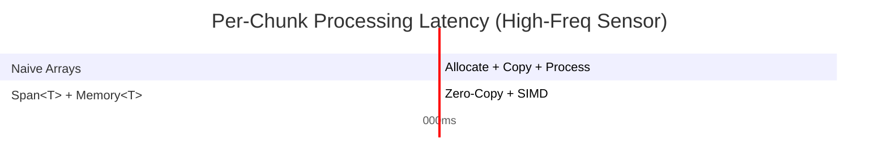

# AI-Question09 - Why is the use of Span<T> and Memory<T> critical when processing high-frequency sensor data for a real-time ML model in C#?

**`Span<T>` and `Memory<T>`** are foundational for high-performance, low-latency processing of high-frequency sensor data (e.g., IMU, LiDAR, audio, biomedical signals at 100 Hz – 10 kHz+) feeding real-time ML models in C#. They enable **zero-copy slicing**, minimize allocations, reduce GC pressure, and maintain predictable latency — all critical for real-time inference where even millisecond jitter can break timing guarantees.

### Why They Are Critical
High-frequency sensor streams generate massive data volumes with strict latency budgets. Traditional `byte[]` or `float[]` handling creates per-chunk allocations, leading to:

- Frequent Gen0/Gen1 GC pauses → unpredictable latency spikes.
- Cache thrashing from copying data.
- Higher memory bandwidth usage.

`Span<T>` (stack-allocated or ref struct) and `Memory<T>` (heap-backed, await-safe) provide **virtual views** over contiguous memory without copying. This keeps data in place from sensor buffer → preprocessing → tensor → ONNX Runtime / custom model.

**Key Benefits**:
- **Zero-copy pipelines**: Slice incoming buffers directly.
- **GC pressure reduction**: Often 90%+ fewer allocations.
- **SIMD friendliness**: Works seamlessly with `System.Numerics.Vector<T>`.
- **Real-time predictability**: Bounded latency suitable for embedded, robotics, or edge ML.
- **Memory efficiency**: Pooling + renting via `ArrayPool<T>` + `Memory<T>`.

**Traditional vs Span/Memory Pipeline**
```mermaid
flowchart TD
    A[Sensor Hardware Buffer] --> B[Traditional: Copy to new float[]]
    B --> C[GC Pressure + Allocations]
    C --> D[Preprocessing]
    D --> E[ONNX Tensor]

    F[Sensor Hardware Buffer] --> G[Span<T> / Memory<T> View]
    G --> H[Zero-Copy Preprocess + SIMD]
    H --> I[Direct Tensor Creation]
    style G fill:#90EE90
    style H fill:#90EE90
```

### Code Example: Real-Time Sensor Processing Pipeline
```csharp
using System;
using System.Buffers;
using System.Numerics;
using Microsoft.ML.OnnxRuntime;
using Microsoft.ML.OnnxRuntime.Tensors;

public class RealTimeSensorProcessor : IDisposable
{
    private readonly InferenceSession _session;
    private readonly ArrayPool<float> _pool = ArrayPool<float>.Shared;

    public RealTimeSensorProcessor(string onnxModelPath)
    {
        var options = new SessionOptions();
        options.GraphOptimizationLevel = GraphOptimizationLevel.ORT_ENABLE_ALL;
        _session = new InferenceSession(onnxModelPath, options);
    }

    // Called at high frequency (e.g., from sensor callback)
    public void ProcessSensorData(ReadOnlyMemory<byte> rawData, int samplesPerChunk)
    {
        // Zero-copy conversion (assume float sensor data)
        var floatMemory = MemoryMarshal.Cast<byte, float>(rawData);
        ReadOnlySpan<float> sensorSpan = floatMemory.Span;

        // Rent buffer only when needed (pooled)
        float[]? processedBuffer = null;
        Span<float> processedSpan = sensorSpan.Length <= 1024 
            ? stackalloc float[sensorSpan.Length] 
            : (processedBuffer = _pool.Rent(sensorSpan.Length)).AsSpan(0, sensorSpan.Length);

        // In-place normalization + feature extraction with SIMD
        NormalizeAndExtractFeatures(sensorSpan, processedSpan);

        // Create tensor with NO copy using Memory<T>
        var tensor = new DenseTensor<float>(processedSpan.ToArray(), new[] { 1, 1, processedSpan.Length }); // shape for model

        var inputs = new List<NamedOnnxValue> { NamedOnnxValue.CreateFromTensor("input", tensor) };

        using var results = _session.Run(inputs);
        // Process output...

        if (processedBuffer != null) _pool.Return(processedBuffer);
    }

    private static void NormalizeAndExtractFeatures(ReadOnlySpan<float> input, Span<float> output)
    {
        float sum = 0f, sumSq = 0f;
        int vectorSize = Vector<float>.Count;

        for (int i = 0; i <= input.Length - vectorSize; i += vectorSize)
        {
            var v = new Vector<float>(input.Slice(i));
            sum += Vector.Sum(v);
            sumSq += Vector.Sum(v * v);
        }

        // Scalar tail + normalization...
        float mean = sum / input.Length;
        // ... (full normalization logic)
        
        input.CopyTo(output); // or process in-place
    }

    public void Dispose() => _session.Dispose();
}
```

### Performance Impact in Real-Time ML
- **Latency**: Zero-copy + SIMD can reduce per-chunk processing from 5–10 ms (naive) to sub-millisecond on modern hardware.
- **Throughput**: Handles 10 kHz+ sampling rates reliably without dropping frames.
- **GC Behavior**: Eliminates frequent small allocations that trigger collections during critical inference windows.
- **Edge / Embedded**: Essential for .NET on ARM64 devices, IoT, or MAUI-based real-time apps where memory is constrained.

**Latency Impact**


### Best Practices for Real-Time Sensor + ML Pipelines
- Prefer `ReadOnlySpan<T>` for input data.
- Use `Memory<T>` / `IMemoryOwner<T>` for longer-lived or async flows.
- Combine with `System.IO.Pipelines` for network/sensor streams.
- Profile with `dotnet-trace` / `PerfView` focusing on allocation rates and GC pauses.
- Integrate with ONNX Runtime GenAI or custom embedding logic for end-to-end real-time inference.
- Use `stackalloc` for very small fixed-size windows.

In modern .NET AI applications, mastering `Span<T>` and `Memory<T>` is what separates prototype code from production-grade, deterministic real-time systems. They form the low-level foundation that makes high-frequency sensor fusion with ML models both feasible and performant in C#. This approach is widely recommended in Microsoft performance guides and real-time .NET patterns for IoT and edge AI.