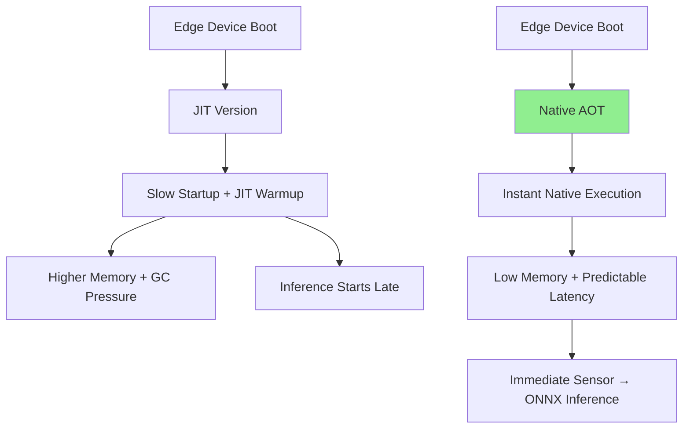
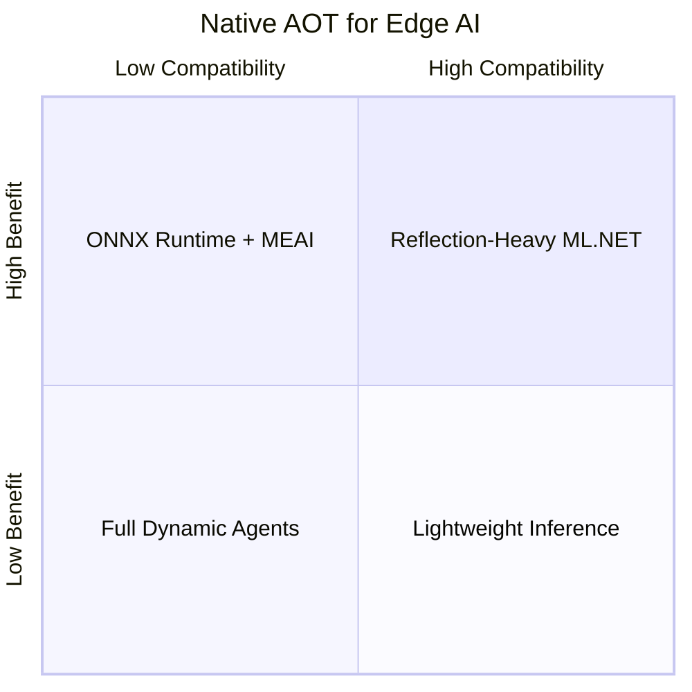

# AI-Question10 - How does "Native Ahead-of-Time" (AOT) compilation in .NET 8/9 benefit AI "Edge" applications? What are the trade-offs regarding reflection-heavy ML libraries?

**Native Ahead-of-Time (AOT) compilation** in .NET 8 and .NET 9 (with further refinements in later versions) produces fully native executables at publish time, eliminating the JIT compiler at runtime. This delivers major advantages for **AI Edge applications** — such as on-device inference in IoT, robotics, mobile (MAUI), embedded systems, or disconnected industrial scenarios — where startup time, memory footprint, binary size, and security are paramount.

### Key Benefits for AI Edge Applications
- **Faster Startup & Predictable Latency**: No JIT warmup. Critical for cold-start scenarios in edge devices or serverless-like edge functions. AI apps (e.g., real-time sensor inference with ONNX Runtime) launch and begin processing in tens of milliseconds instead of hundreds.
- **Smaller Footprint & Memory Usage**: Aggressive trimming removes unused code/metadata. Results in compact binaries (often 40-70% smaller) and lower runtime memory — ideal for resource-constrained edge hardware (ARM64 devices, Raspberry Pi, etc.).
- **No .NET Runtime Dependency**: Self-contained native executables run without installing the .NET runtime, simplifying deployment and reducing attack surface.
- **Security & Restricted Environments**: No JIT means no runtime code generation, which is valuable in locked-down edge environments (e.g., industrial OT networks).
- **Better Battery & Resource Efficiency**: Lower CPU/memory overhead during inference loops using ONNX Runtime, Microsoft.Extensions.AI, or custom `Vector<T>` pipelines.

**JIT vs Native AOT for Edge AI**


### Integration with .NET AI Stack on Edge
Native AOT works excellently with **ONNX Runtime** (core inference engine) and lighter components of **Microsoft.Extensions.AI**. You can publish edge apps consuming exported ONNX models with full hardware acceleration (CPU SIMD, DirectML, etc.).

**Example Project Setup (.csproj):**
```xml
<Project Sdk="Microsoft.NET.Sdk">
  <PropertyGroup>
    <OutputType>Exe</OutputType>
    <TargetFramework>net9.0</TargetFramework>
    <PublishAot>true</PublishAot>
    <SelfContained>true</SelfContained>
    <RuntimeIdentifier>linux-arm64</RuntimeIdentifier> <!-- or win-x64, osx-arm64, etc. -->
    <TrimMode>full</TrimMode>
  </PropertyGroup>
</Project>
```

**Simple Edge Inference Example:**
```csharp
using Microsoft.ML.OnnxRuntime;
using Microsoft.ML.OnnxRuntime.Tensors;

public class EdgeAiInference
{
    private readonly InferenceSession _session;

    public EdgeAiInference(string onnxModelPath)
    {
        var options = new SessionOptions();
        options.GraphOptimizationLevel = GraphOptimizationLevel.ORT_ENABLE_ALL;
        // Add execution providers: CPU, QNN (Qualcomm), etc.
        _session = new InferenceSession(onnxModelPath, options);
    }

    public float[] RunInference(float[] inputData, int[] shape)
    {
        var tensor = new DenseTensor<float>(inputData, shape);
        var inputs = new List<NamedOnnxValue> { NamedOnnxValue.CreateFromTensor("input", tensor) };

        using var results = _session.Run(inputs);
        return results.First().AsTensor<float>().ToArray();
    }
}

// Usage in edge loop (e.g., sensor callback)
var predictor = new EdgeAiInference("model.onnx");
while (running)
{
    var sensorData = ReadSensorSpan(); // Span<T> for zero-copy
    var result = predictor.RunInference(...);
    ProcessResult(result);
}
```

### Trade-offs with Reflection-Heavy ML Libraries
Native AOT's static nature (full trimming + no runtime code gen) creates challenges for libraries relying on reflection, dynamic code generation (`System.Reflection.Emit`), or runtime type discovery.

- **ML.NET**: Limited or challenging AOT compatibility as of early 2025–2026; heavy use of reflection for model loading and dynamic pipelines often requires significant workarounds or is not fully supported.
- **Semantic Kernel**: Ongoing efforts for AOT compatibility, but features like dynamic plugin loading, certain prompt templates, or reflection-based function invocation may need explicit `[DynamicallyAccessedMembers]` annotations, `JsonSerializer` source generation, or trimming suppressions.
- **System.Text.Json & Other Reflection**: Works well with source generators, but dynamic scenarios (e.g., runtime plugin discovery) need explicit configuration.
- **General Impact**:
  - Increased build-time warnings/errors from trim/AOT analyzers.
  - Larger binaries if you must preserve reflection metadata.
  - Potential runtime failures if types/members are trimmed unexpectedly.
  - Slower development iteration (rebuild full native binary vs. JIT).

**Mitigations**:
- Use `DynamicallyAccessedMembersAttribute`, `RequiresUnreferencedCode`, and source-generated serializers.
- Prefer compile-time known types and minimal reflection.
- Hybrid approaches: Core inference in AOT, complex orchestration in JIT where needed.
- Test thoroughly with `dotnet publish -r <rid> --self-contained`.

**Trade-off Summary**


In summary, **Native AOT** makes .NET a strong choice for performant, deployable AI Edge applications by producing lean, fast, self-contained binaries optimized for constrained environments. Pair it with ONNX Runtime and careful architecture to maximize gains while navigating reflection limitations in heavier orchestration libraries. This pattern is actively evolving with strong Microsoft investment in .NET AI deployments. Consult official .NET Learn documentation for the latest AOT compatibility guidance.