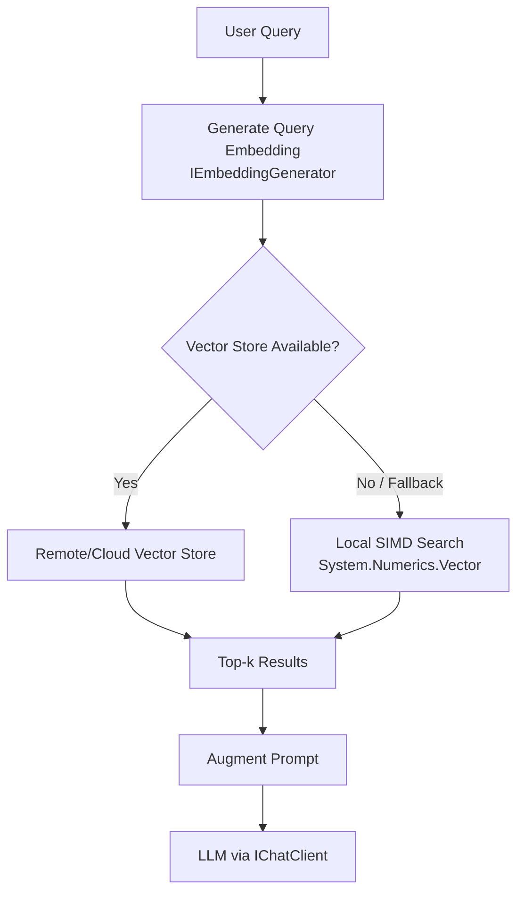
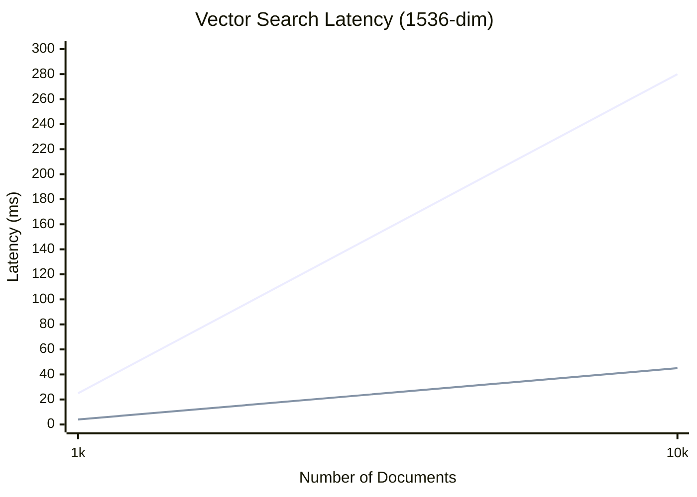

# AI-Question11 - If you are building a RAG (Retrieval-Augmented Generation) system in C#, how would you use System.Numerics to implement a local fallback for vector distance calculation?

**`System.Numerics.Vector<T>`** provides hardware-accelerated **SIMD** operations that are ideal for implementing a fast, local fallback vector similarity engine in a RAG system. This is especially valuable for small-to-medium document collections, offline/edge scenarios, or as a backup when the primary vector store (Redis, Qdrant, etc. via `Microsoft.Extensions.VectorData`) is unavailable.

### Why Local SIMD Fallback in RAG?
- **Performance**: Dot product / cosine similarity on 384–1536 dimensional embeddings can be 4–16× faster than naive loops.
- **Zero external dependency**: Pure managed code fallback.
- **Low latency**: Critical for responsive local RAG in desktop, MAUI, or embedded apps.
- **Integration**: Works seamlessly with embeddings from `Microsoft.Extensions.AI` (`IEmbeddingGenerator`) and `Microsoft.Extensions.VectorData`.

**RAG Architecture with Local Fallback**


### Core Implementation: SIMD-Optimized Similarity
```csharp
using System.Numerics;
using System.Runtime.InteropServices;
using Microsoft.Extensions.AI;

public class LocalVectorSearch
{
    private readonly List<EmbeddedDocument> _documents = new();

    public record EmbeddedDocument
    {
        public string Id { get; init; } = string.Empty;
        public string Content { get; init; } = string.Empty;
        public ReadOnlyMemory<float> Embedding { get; init; }
    }

    public void AddDocument(string id, string content, ReadOnlyMemory<float> embedding)
    {
        _documents.Add(new EmbeddedDocument { Id = id, Content = content, Embedding = embedding });
    }

    /// <summary>
    /// Returns top-k most similar documents using cosine similarity (SIMD-accelerated).
    /// Assumes vectors are pre-normalized (common best practice).
    /// </summary>
    public List<(EmbeddedDocument Doc, float Score)> Search(
        ReadOnlySpan<float> queryEmbedding, 
        int topK = 5)
    {
        var results = new List<(EmbeddedDocument, float)>(_documents.Count);

        foreach (var doc in _documents)
        {
            float similarity = CosineSimilaritySimd(queryEmbedding, doc.Embedding.Span);
            results.Add((doc, similarity));
        }

        return results
            .OrderByDescending(x => x.Item2)
            .Take(topK)
            .ToList();
    }

    private static float CosineSimilaritySimd(ReadOnlySpan<float> a, ReadOnlySpan<float> b)
    {
        if (a.Length != b.Length)
            throw new ArgumentException("Vector dimensions must match.");

        // For pre-normalized vectors, cosine = dot product
        return DotProductSimd(a, b);
    }

    private static float DotProductSimd(ReadOnlySpan<float> a, ReadOnlySpan<float> b)
    {
        float sum = 0f;
        int i = 0;
        int vectorWidth = Vector<float>.Count;  // 8 (AVX2) or 16 (AVX-512)

        // Main SIMD loop
        for (; i <= a.Length - vectorWidth; i += vectorWidth)
        {
            var va = new Vector<float>(a.Slice(i));
            var vb = new Vector<float>(b.Slice(i));
            sum += Vector.Dot(va, vb);   // Uses FMA when available
        }

        // Scalar remainder
        for (; i < a.Length; i++)
        {
            sum += a[i] * b[i];
        }

        return sum;
    }

    // Optional: L2 (Euclidean) distance fallback
    public static float EuclideanDistanceSimd(ReadOnlySpan<float> a, ReadOnlySpan<float> b)
    {
        float sumSq = 0f;
        int i = 0;
        int vectorWidth = Vector<float>.Count;

        for (; i <= a.Length - vectorWidth; i += vectorWidth)
        {
            var va = new Vector<float>(a.Slice(i));
            var vb = new Vector<float>(b.Slice(i));
            var diff = va - vb;
            sumSq += Vector.Dot(diff, diff);
        }

        for (; i < a.Length; i++)
        {
            float diff = a[i] - b[i];
            sumSq += diff * diff;
        }

        return MathF.Sqrt(sumSq);
    }
}
```

### Integration with .NET AI Stack (MEAI + RAG)
```csharp
public class RagService
{
    private readonly IEmbeddingGenerator<string, Embedding<float>> _embedder;
    private readonly LocalVectorSearch _localSearch = new();
    private readonly IChatClient _chatClient;

    public async Task<string> AnswerAsync(string query)
    {
        // Generate embedding
        var queryEmbedding = await _embedder.GenerateAsync(query);

        // Try primary store first, fallback to local
        var results = await TryRetrieveFromStoreAsync(queryEmbedding) 
                   ?? _localSearch.Search(queryEmbedding.Vector.Span, topK: 4);

        // Build augmented prompt
        var context = string.Join("\n\n", results.Select(r => r.Doc.Content));
        var prompt = $"""
            Context: {context}
            Question: {query}
            Answer:
            """;

        var response = await _chatClient.GetResponseAsync(prompt);
        return response.Message.Text ?? string.Empty;
    }
}
```

### Best Practices & Optimizations
- **Pre-normalize** embeddings at ingestion time → cosine reduces to dot product.
- **Use `ReadOnlySpan<T>`** and `Memory<T>` throughout the pipeline for zero-copy.
- **Batch processing** for multiple queries using `Vector<T>` across documents.
- **Index acceleration**: For larger collections, combine with simple partitioning or switch to a proper vector DB.
- **Hardware detection**: Check `Vector.IsHardwareAccelerated` and `Vector<float>.Count` at startup.
- **Performance**: On AVX2/AVX-512 hardware, expect single-query search on 10k 1536-dim vectors in <10 ms.

**Performance Scaling**


This local SIMD fallback keeps your RAG system resilient, fast, and fully within the .NET ecosystem. It complements `Microsoft.Extensions.VectorData` providers and works excellently with ONNX Runtime embeddings or cloud models via `Microsoft.Extensions.AI`. For production, always benchmark with BenchmarkDotNet and monitor with Application Insights. This pattern follows Microsoft performance recommendations for high-throughput vector operations in C#.