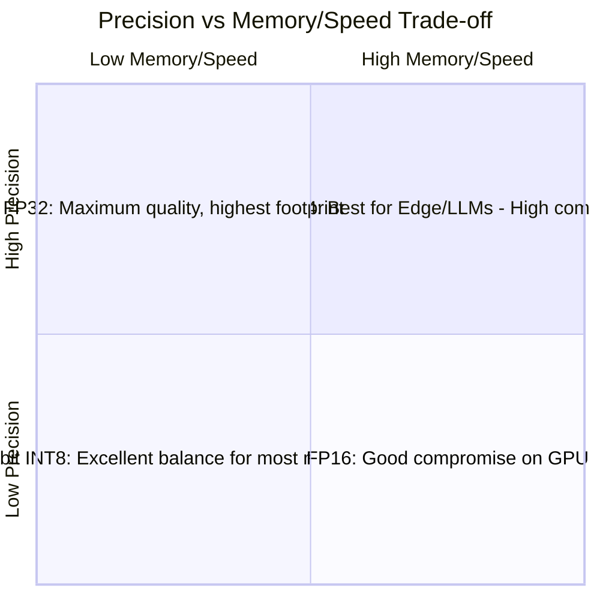
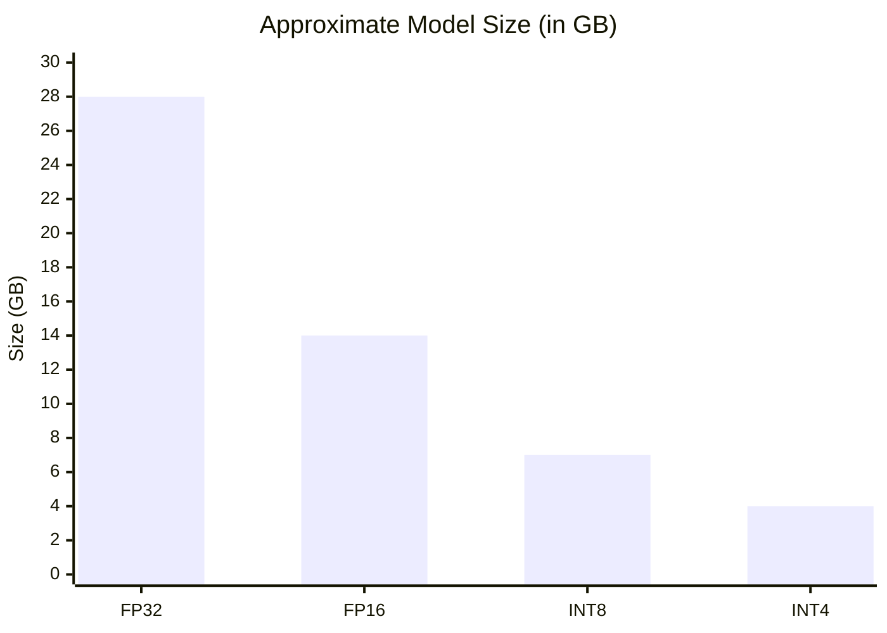

# AI-Question12 - Explain how a C# developer might handle a 4-bit or 8-bit quantized model using the ONNX Runtime. What happens to precision vs. memory footprint?

**ONNX Runtime** in C# fully supports **8-bit (INT8/UINT8)** and **4-bit (INT4/UINT4)** quantized models, making it an excellent choice for deploying smaller, faster models on edge devices, desktops, or resource-constrained environments. Quantization reduces precision to lower memory usage and increase inference speed with minimal accuracy loss when done properly.

### Preparing a Quantized Model (Typically Done in Python)
Quantization is usually performed using **ONNX Runtime quantization tools**, **Olive**, or **ONNX Runtime GenAI model builder** (for LLMs).

**8-bit Quantization** (most common for general models):
- Static or dynamic quantization of weights (and optionally activations).
- Uses QDQ (Quantize-Dequantize) or operator-oriented (Integer ops) format.

**4-bit Quantization** (block-wise, especially for LLMs like Phi-3, Llama):
- Weight-only quantization (common with AWQ/GPTQ).
- Supported via opset 21+ with INT4/UINT4 types and block quantization.

**Example (using ONNX Runtime GenAI for LLMs):**
```bash
python -m onnxruntime_genai.models.builder \
  -m microsoft/Phi-3-mini-4k-instruct \
  -o phi3-int4-onnx \
  -p int4 \
  -e cpu   # or cuda, dml
```

This produces an optimized `.onnx` model folder with quantized weights.

### Consuming Quantized Models in C#
Loading and running a quantized model uses the **same API** as FP32 models. ONNX Runtime automatically handles dequantization and optimized integer kernels where supported.

**Basic Example (Microsoft.ML.OnnxRuntime):**
```csharp
using Microsoft.ML.OnnxRuntime;
using Microsoft.ML.OnnxRuntime.Tensors;
using System.Collections.Generic;

public class QuantizedInference
{
    private readonly InferenceSession _session;

    public QuantizedInference(string modelPath)
    {
        var sessionOptions = new SessionOptions();
        sessionOptions.GraphOptimizationLevel = GraphOptimizationLevel.ORT_ENABLE_ALL;
        
        // Enable hardware acceleration
        // sessionOptions.AppendExecutionProvider_CUDA(0); // or DirectML, CoreML, etc.
        
        _session = new InferenceSession(modelPath, sessionOptions);
    }

    public float[] RunInference(float[] inputData, int[] inputShape)
    {
        var inputTensor = new DenseTensor<float>(inputData, inputShape);
        var inputs = new List<NamedOnnxValue>
        {
            NamedOnnxValue.CreateFromTensor("input", inputTensor)
        };

        using var results = _session.Run(inputs);
        var outputTensor = results.First().AsTensor<float>();  // Outputs usually remain float
        
        return outputTensor.ToArray();
    }
}
```

For **generative LLMs**, prefer **Microsoft.ML.OnnxRuntimeGenAI**:
```csharp
using Microsoft.ML.OnnxRuntimeGenAI;

using var model = new Model("phi3-int4-onnx");  // Path to quantized folder
using var tokenizer = new Tokenizer(model);
using var generator = new Generator(model, new GeneratorParams { /* config */ });

// Streaming generation works identically to FP models
```

### Precision vs. Memory Footprint Trade-offs
- **8-bit Quantization**:
  - Memory: ~4× reduction vs. FP32 (1 byte per weight vs. 4 bytes).
  - Speed: Significant gains on CPU (VNNI/AVX, ARM dotprod) and supported GPUs. Integer math is faster.
  - Precision: Small drop (typically <1-2% accuracy loss for classification; very good for many tasks).

- **4-bit Quantization** (block-wise, common for LLMs):
  - Memory: ~8× reduction vs. FP32; ~4× vs. FP16. Enables running 7B–13B+ models on consumer hardware (e.g., 8–16 GB RAM).
  - Speed: Excellent throughput (up to 3–20× vs. FP16 in some GenAI cases) due to lower memory bandwidth and specialized kernels.
  - Precision: Noticeable but often acceptable degradation (perplexity increase, minor quality loss in generation). Use AWQ/GPTQ + calibration data for best results. Block size (e.g., 128) balances quality and compression.

**Quantization Impact**


**Memory Footprint Comparison (7B parameter model)**


### Best Practices in C#/.NET AI Stack
- Use **ONNX Runtime GenAI** for modern LLMs with 4-bit support.
- Combine with **Microsoft.Extensions.AI** for provider abstraction and **Semantic Kernel** for orchestration.
- Test accuracy on your domain data after quantization.
- Profile with hardware-specific Execution Providers (CPU, CUDA, DirectML, QNN for edge).
- Use `Span<T>` / `Memory<T>` for input preprocessing to maintain performance.
- Monitor with `SessionOptions` tuning (intra/inter op threads, optimization level).

Quantized models via ONNX Runtime allow C# developers to run powerful AI on-device or at scale with dramatically reduced resource requirements, making .NET highly competitive for edge and cost-sensitive deployments. The minor precision trade-off is usually well worth the gains in speed, memory, and accessibility. For the latest details, refer to official ONNX Runtime quantization and GenAI documentation.