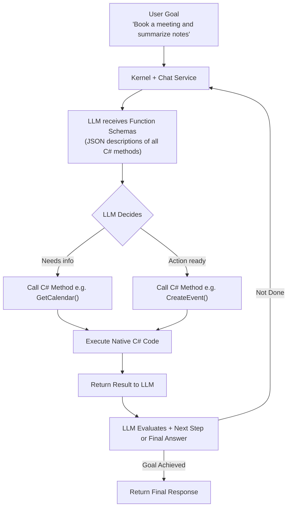
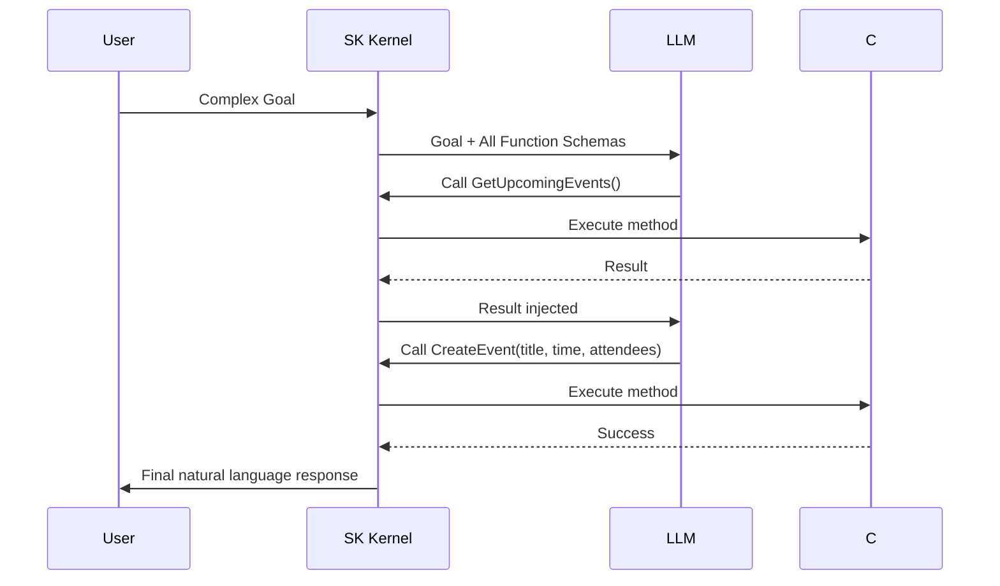

# AI - Question13 - Describe the "Planner" concept in Microsoft’s Semantic Kernel. How does it allow an AI to autonomously choose which C# methods to execute to solve a complex goal?

**In modern Semantic Kernel (as of 2025–2026), the dedicated "Planner" classes** (such as the old Sequential, Stepwise, and Handlebars Planners) have been deprecated and removed from the core package. The recommended and far more powerful approach is **automatic function calling** (also called tool calling) integrated directly with the `Kernel` and chat completion services. This mechanism effectively *is* the current Planner.

### What is the Planner Concept?
A **Planner** in Semantic Kernel is an orchestration component that enables an LLM to break down a complex natural-language **goal** into a sequence of executable steps by intelligently selecting and invoking registered **plugins** (collections of functions). These functions can be:

- **Native Functions**: Plain C# methods decorated with `[KernelFunction]`.
- **Prompt Functions**: Semantic prompts defined in YAML or inline.

The AI autonomously decides *which* C# methods to call, *in what order*, with *what parameters*, and can iterate (observe results and replan) until the goal is achieved.

**Mermaid: Modern Function-Calling Planner Flow**


### How It Allows Autonomous C# Method Execution

1. **Function Exposure**: You register plugins. Semantic Kernel automatically generates detailed JSON schemas (including descriptions, parameter types, and `KernelFunction` attributes) for the LLM.

2. **Automatic Tool Choice**: Set `FunctionChoiceBehavior.Auto()` (or `Required`/`None`). The LLM receives these schemas in every request.

3. **Iterative Execution Loop**: SK handles the full ReAct-style loop internally:
   - LLM requests one or more function calls (parallel supported).
   - SK invokes the corresponding C# methods.
   - Results are injected back into the chat history.
   - LLM decides the next action or produces a final answer.

This gives the AI true autonomy while keeping all business logic safely in your strongly-typed C# code.

### Code Example: Autonomous Planning via Function Calling
```csharp
using Microsoft.SemanticKernel;
using Microsoft.SemanticKernel.ChatCompletion;
using Microsoft.SemanticKernel.Connectors.OpenAI;

public class CalendarPlugin
{
    [KernelFunction("GetUpcomingEvents")]
    [Description("Retrieves upcoming calendar events")]
    public async Task<string> GetUpcomingEventsAsync()
    {
        // Real implementation (Outlook, Google, etc.)
        return "Team sync at 10am tomorrow";
    }

    [KernelFunction("CreateEvent")]
    [Description("Creates a new calendar event")]
    public async Task<string> CreateEventAsync(string title, string dateTime, string attendees)
    {
        // Business logic here
        return $"Event '{title}' created successfully.";
    }
}

// Setup
var builder = Kernel.CreateBuilder()
    .AddAzureOpenAIChatCompletion("gpt-4o", endpoint, apiKey);

builder.Plugins.AddFromType<CalendarPlugin>("Calendar");
Kernel kernel = builder.Build();

var chatService = kernel.GetRequiredService<IChatCompletionService>();

// Enable autonomous planning
var executionSettings = new OpenAIPromptExecutionSettings
{
    FunctionChoiceBehavior = FunctionChoiceBehavior.Auto()  // This is the Planner
};

var history = new ChatHistory();
history.AddUserMessage("Schedule a 30-minute sync with the team tomorrow at 10am and confirm availability.");

var result = await chatService.GetChatMessageContentAsync(
    history, 
    executionSettings, 
    kernel);  // SK handles multiple tool calls automatically

Console.WriteLine(result);
```

**Mermaid: Single Interaction with Autonomous Steps**


### Key Advantages
- **Autonomy**: The LLM dynamically composes solutions using your C# logic without hard-coded workflows.
- **Safety**: All execution stays within your controlled C# methods (no arbitrary code gen in production).
- **Observability**: Full chat history shows every tool call and result.
- **Extensibility**: Combine with `Microsoft.Extensions.AI`, memory/vector stores (RAG), and agents.
- **Performance**: Leverages native function calling in modern models (OpenAI, Azure, Anthropic, etc.) — faster and more reliable than old prompt-based planners.

**Note on Legacy Planners**: Older `HandlebarsPlanner` and `StepwisePlanner` are no longer recommended or included by default. Microsoft now directs developers to function calling for new applications due to superior flexibility, streaming support, and accuracy.

This function-calling planner pattern is the foundation of modern agentic applications in Semantic Kernel. It transforms static C# methods into dynamic, AI-orchestrated capabilities while maintaining full type safety and enterprise control. For the latest patterns, refer to the official Microsoft Learn documentation on Semantic Kernel planning and function calling.