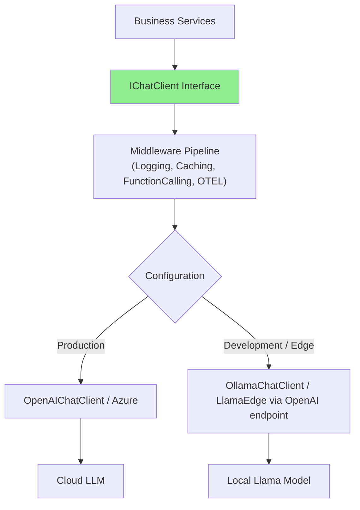
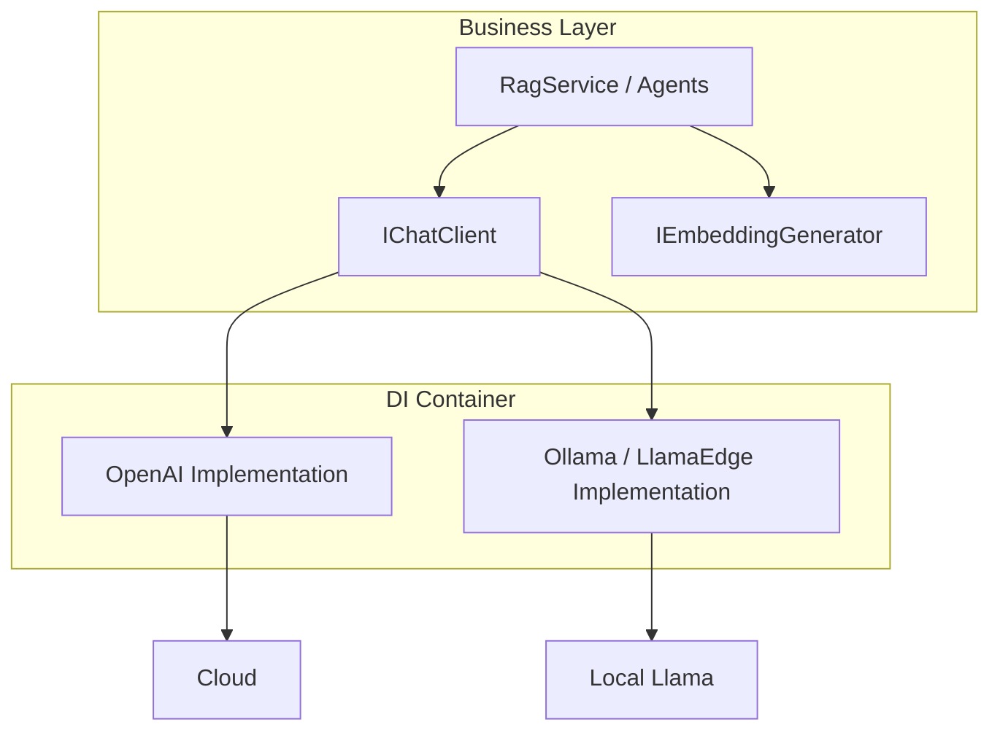

# AI - Question 14 - How would you design a DI-friendly service that can swap between local LlamaEdge models and OpenAI cloud models without changing the business logic?

**Use `Microsoft.Extensions.AI` abstractions** (`IChatClient` and `IEmbeddingGenerator<TInput, TEmbedding>`) for a clean, DI-friendly, provider-agnostic design. This allows seamless swapping between cloud OpenAI and local models (via Ollama for Llama models or LlamaEdge’s OpenAI-compatible server) without altering business logic.

### Core Design Principle
Code against the **abstractions** (`IChatClient`). Register the concrete implementation (OpenAI, Azure, Ollama, etc.) in the DI container via configuration or environment. Middleware (logging, retry, telemetry, function calling) applies uniformly.

**Provider-Agnostic Architecture**


### DI Registration (Program.cs / Startup)
```csharp
using Microsoft.Extensions.AI;
using Microsoft.Extensions.DependencyInjection;
using Microsoft.Extensions.Configuration;

var builder = WebApplication.CreateBuilder(args);

// Read configuration
var aiSettings = builder.Configuration.GetSection("AI").Get<AISettings>() ?? new();

IChatClient chatClient;

if (aiSettings.UseLocalModel)
{
    // Local: Ollama (recommended for Llama models)
    chatClient = new OllamaChatClient(
        new Uri(aiSettings.LocalEndpoint ?? "http://localhost:11434"),
        aiSettings.LocalModel ?? "llama3.2");
    
    // Alternative: LlamaEdge (OpenAI-compatible server)
    // chatClient = new OpenAIChatClient(
    //     new OpenAIClient(new ApiKeyCredential("ignored"), new OpenAIClientOptions
    //     {
    //         Endpoint = new Uri(aiSettings.LocalEndpoint)
    //     }))
    //     .GetChatClient(aiSettings.LocalModel);
}
else
{
    // Cloud
    chatClient = new OpenAIChatClient(aiSettings.OpenAIModel, aiSettings.ApiKey);
    // Or Azure: new AzureOpenAIChatClient(...)
}

// Add to DI with middleware
builder.Services.AddChatClient(chatClient)
    .UseLogging()
    .UseFunctionInvocation()      // For tool calling / agents
    .UseOpenTelemetry();          // Observability

// Optional: Keyed services for multiple models
// builder.Services.AddKeyedChatClient("local", localClient);
// builder.Services.AddKeyedChatClient("cloud", cloudClient);
```

**Configuration Example (appsettings.json):**
```json
{
  "AI": {
    "UseLocalModel": true,
    "LocalEndpoint": "http://localhost:11434",
    "LocalModel": "llama3.2",
    "OpenAIModel": "gpt-4o",
    "ApiKey": "sk-..."
  }
}
```

### DI-Friendly Service (No Provider Awareness)
```csharp
public interface IRagService
{
    Task<string> AnswerQuestionAsync(string question, CancellationToken ct = default);
}

public class RagService : IRagService
{
    private readonly IChatClient _chatClient;
    private readonly IEmbeddingGenerator<string, Embedding<float>> _embeddingGenerator; // Optional for RAG

    public RagService(IChatClient chatClient, IEmbeddingGenerator<string, Embedding<float>> embeddingGenerator)
    {
        _chatClient = chatClient;
        _embeddingGenerator = embeddingGenerator;
    }

    public async Task<string> AnswerQuestionAsync(string question, CancellationToken ct = default)
    {
        // Business logic stays identical regardless of provider
        var history = new ChatHistory();
        history.AddUserMessage(question);

        // Optional: RAG retrieval using embeddings...

        var response = await _chatClient.GetResponseAsync(
            history,
            new ChatOptions { Temperature = 0.7f },
            ct);

        return response.Message.Text ?? string.Empty;
    }
}

// Registration
builder.Services.AddScoped<IRagService, RagService>();
```

**Mermaid: Service Dependency Flow**


### Key Benefits
- **Zero business logic changes** when switching providers.
- **Middleware reuse** — logging, retry, caching, and function calling work for both local and cloud.
- **Environment-specific** behavior via configuration (local for dev/privacy, cloud for production scale/quality).
- **Streaming support** remains identical using `IAsyncEnumerable<StreamingChatCompletionUpdate>`.
- **Semantic Kernel compatibility** — SK works natively on top of `IChatClient`.

### Local Model Notes (Llama)
- **Ollama** is the most common, stable choice for Llama models in .NET via `OllamaSharp` / `Microsoft.Extensions.AI.Ollama` (or successor packages).
- **LlamaEdge** exposes an OpenAI-compatible endpoint, so the standard `OpenAIChatClient` with a custom `Endpoint` works perfectly.
- For pure native execution without a server, consider LLamaSharp or ONNX Runtime GenAI with custom wrappers implementing `IChatClient`.

This design follows official Microsoft recommendations for provider-agnostic .NET AI applications. It scales from development (fast local iteration) to production (cloud reliability) while keeping your core application code clean and maintainable. Always test model-specific behaviors (context length, tool calling quality) when swapping. Refer to Microsoft Learn documentation for `Microsoft.Extensions.AI` for the latest configuration patterns.