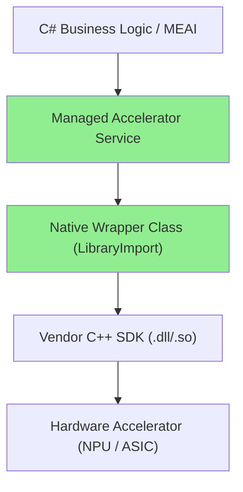
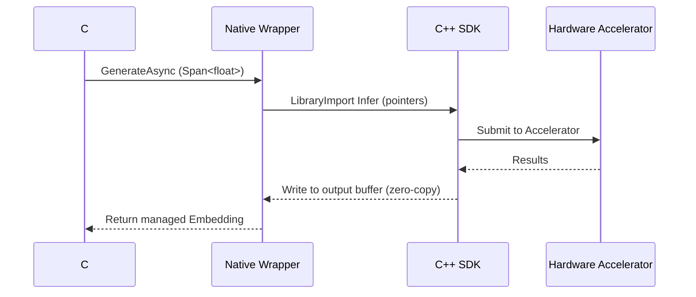

# AI - Question 15 - If a specific AI hardware accelerator only provides a C++ SDK, how would you design a high-performance C# wrapper using LibraryImport?

**`LibraryImport`** (introduced in .NET 7 and recommended for .NET 8/9+) is the modern, source-generated approach for high-performance P/Invoke. It replaces the older `DllImport` with compile-time code generation, better performance, improved AOT compatibility, and easier debugging. This is the preferred way to wrap a C++ AI hardware accelerator SDK (e.g., for NPUs, custom ASICs, or vendor-specific inference engines) in C#.

### Design Principles for High-Performance Wrapper
- **Thin, low-marshalling layer**: Use blittable types (`float`, `int`, `Span<T>`, pointers) to minimize copying.
- **Resource management**: Implement `IDisposable` with `SafeHandle` for native contexts/handles.
- **Zero-copy where possible**: Leverage `Span<T>` / `Memory<T>` and `unsafe` for tensor buffers.
- **Error handling**: Map native error codes to managed exceptions.
- **Abstraction**: Expose a clean C# interface that integrates with `Microsoft.Extensions.AI` or ONNX Runtime patterns.
- **Platform targeting**: Use runtime identifiers and conditional compilation for different accelerators.

**Wrapper Architecture**


### High-Performance Wrapper Implementation
```csharp
using System.Runtime.InteropServices;
using System.Runtime.CompilerServices;
using Microsoft.Extensions.AI; // Optional integration

// Native library wrapper (static class recommended by Microsoft)
internal static partial class NativeAccelerator
{
    private const string LibName = "accelerator_sdk"; // .dll / .so / .dylib

    [LibraryImport(LibName, EntryPoint = "acc_create_context")]
    [UnmanagedCallConv(CallConv.Cdecl)]
    public static partial nint CreateContext(int deviceId, out int errorCode);

    [LibraryImport(LibName, EntryPoint = "acc_destroy_context")]
    [UnmanagedCallConv(CallConv.Cdecl)]
    public static partial int DestroyContext(nint context);

    [LibraryImport(LibName, EntryPoint = "acc_infer")]
    [UnmanagedCallConv(CallConv.Cdecl)]
    public static unsafe partial int Infer(
        nint context,
        float* inputTensor,
        int inputLength,
        float* outputTensor,
        int outputLength,
        out int tokensProcessed);
}

// SafeHandle for automatic resource cleanup
public sealed class AcceleratorContext : SafeHandle
{
    public AcceleratorContext(int deviceId = 0) : base(IntPtr.Zero, true)
    {
        int error = 0;
        handle = NativeAccelerator.CreateContext(deviceId, out error);
        if (error != 0 || handle == IntPtr.Zero)
            throw new InvalidOperationException($"Failed to create accelerator context. Error: {error}");
    }

    public override bool IsInvalid => handle == IntPtr.Zero;

    protected override bool ReleaseHandle() 
        => NativeAccelerator.DestroyContext(handle) == 0;
}

// High-level managed service
public class AcceleratorInferenceService : IEmbeddingGenerator<string, Embedding<float>>, IDisposable
{
    private readonly AcceleratorContext _context;

    public AcceleratorInferenceService(int deviceId = 0)
    {
        _context = new AcceleratorContext(deviceId);
    }

    public async Task<Embedding<float>> GenerateAsync(
        string input, 
        CancellationToken cancellationToken = default)
    {
        // Tokenize / preprocess in managed code (Span<T>)
        float[] inputData = PreprocessInput(input); // Your logic
        float[] outputData = new float[OutputDim];   // e.g., 384 or 1536

        unsafe
        {
            fixed (float* pInput = inputData)
            fixed (float* pOutput = outputData)
            {
                int result = NativeAccelerator.Infer(
                    _context.DangerousGetHandle(),
                    pInput, inputData.Length,
                    pOutput, outputData.Length,
                    out _);

                if (result != 0) throw new InvalidOperationException("Inference failed");
            }
        }

        return new Embedding<float>(outputData);
    }

    public void Dispose() => _context.Dispose();
}
```

### DI Registration (Clean Integration)
```csharp
builder.Services.AddSingleton<IEmbeddingGenerator<string, Embedding<float>>>(
    sp => new AcceleratorInferenceService(deviceId: 0));
```

**Performance-Critical Data Flow**


### Performance & Best Practices
- **LibraryImport advantages**: Source-generated marshalling is faster and trim/AOT-friendly compared to `DllImport`.
- **Minimize overhead**: Use `unsafe` + `fixed` for large tensors; prefer blittable types; avoid strings where possible (use `ReadOnlySpan<byte>`).
- **Threading**: Check SDK thread-safety; use `ObjectPool` for contexts if needed.
- **Error & Diagnostics**: Always check return codes; integrate with `Microsoft.Extensions.Diagnostics`.
- **Packaging**: Include native binaries via `.props` / `RuntimeIdentifiers` in NuGet for cross-platform deployment.
- **Fallback**: Combine with ONNX Runtime for CPU fallback.

This design delivers near-native performance while maintaining a clean, idiomatic C# API that integrates seamlessly with the broader .NET AI stack (`Microsoft.Extensions.AI`, Semantic Kernel, etc.). It follows official Microsoft native interop best practices. Always validate with benchmarks (`BenchmarkDotNet`) and test on target hardware. For the latest guidance, consult the .NET documentation on `LibraryImport` and native interoperability.