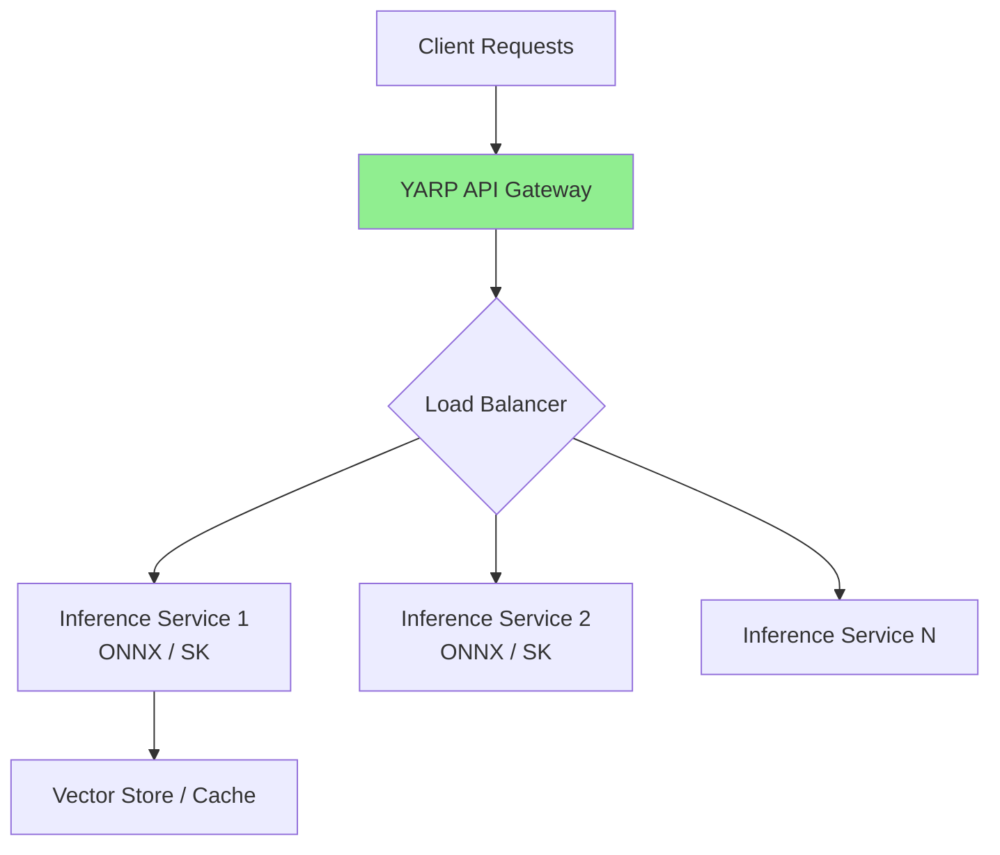

# AI - Question16 - How do .NET Aspire or YARP (Yet Another Reverse Proxy) facilitate the scaling of AI inference engines across a cluster?

**`.NET Aspire` and `YARP` (Yet Another Reverse Proxy)** work together effectively to scale AI inference engines across a cluster by providing orchestration, service discovery, health checks, load balancing, and observability in a .NET-native way.

### .NET Aspire – Orchestration & Cluster-Ready Deployment
**.NET Aspire** is a cloud-native application stack that excels at modeling, running, and deploying distributed systems, including AI inference services (e.g., ONNX Runtime, Semantic Kernel agents, Ollama, or custom inference APIs).

**Key Scaling Facilitation Features**:
- **AppHost orchestration**: Define multiple inference service replicas, databases (vector stores), caching layers, and frontends in one place.
- **Service discovery & health checks**: Automatic registration and routing to healthy instances.
- **Kubernetes publishing**: Generate Helm charts or deploy directly with replica scaling, autoscaling policies, and resource requests (GPU support via custom resource definitions).
- **AI-specific integrations**: Hosting for models, Azure AI, GitHub Models, and telemetry for inference workloads.
- **Observability**: Built-in dashboard, OpenTelemetry, and metrics for monitoring token throughput, latency, and GPU utilization.

**Example AppHost Configuration** (simplified):
```csharp
var builder = DistributedApplication.CreateBuilder(args);

var inferenceApi = builder.AddProject<Projects.InferenceService>("inference")
    .WithReplicas(3)                    // Scale horizontally
    .WithContainerResourceLimits(cpu: 4, memory: "8Gi")
    // GPU support via custom resource or container runtime
    .WithHttpEndpoint(port: 8080, name: "http");

var vectorStore = builder.AddRedis("redis");

builder.AddProject<Projects.ApiGateway>("gateway")
    .WithReference(inferenceApi)
    .WithReference(vectorStore);

await builder.Build().RunAsync();
```

When published to Kubernetes, Aspire can configure replica counts, Horizontal Pod Autoscalers (HPA), and service meshes for traffic distribution.

### YARP – Intelligent Load Balancing & API Gateway
**YARP** acts as a high-performance, customizable reverse proxy and API gateway in front of your inference services. It distributes requests across multiple inference engine instances (horizontal scaling) while adding AI-specific capabilities.

**Key Scaling Capabilities**:
- **Load balancing policies**: Round-robin, least requests, power of two choices, etc.
- **Health checks & passive monitoring**: Automatically removes unhealthy inference nodes.
- **Session affinity / sticky sessions**: Useful for stateful inference (e.g., conversation history).
- **Request routing & transformation**: Route based on model name, user tier, or content (e.g., /v1/chat/completions → specific backend pool).
- **Rate limiting & throttling**: Protect expensive inference endpoints.
- **High throughput**: Low-overhead forwarding suitable for high QPS token generation.

**YARP Configuration Example** (in gateway project):
```csharp
var builder = WebApplication.CreateBuilder(args);

builder.Services.AddReverseProxy()
    .LoadFromConfig(builder.Configuration.GetSection("ReverseProxy"))
    .AddTransforms(); // Custom transforms for AI headers, etc.

var app = builder.Build();
app.MapReverseProxy();
app.Run();
```

**appsettings.json snippet**:
```json
{
  "ReverseProxy": {
    "Clusters": {
      "inferenceCluster": {
        "Destinations": {
          "instance1": { "Address": "http://inference-1:8080" },
          "instance2": { "Address": "http://inference-2:8080" }
        },
        "LoadBalancingPolicy": "LeastRequests"
      }
    }
  }
}
```

**Mermaid: Combined Scaling Architecture**


### Combined Power (Aspire + YARP)
- **Aspire** handles **infrastructure & lifecycle** (local dev → Kubernetes deployment, scaling replicas, service discovery).
- **YARP** handles **runtime traffic management** (intelligent routing, load balancing, observability at the edge).
- Together they enable horizontal scaling of inference engines while maintaining low latency and high availability.
- Integrate with **Microsoft.Extensions.AI** abstractions for provider-agnostic code that works across scaled backends.

This pattern is production-proven for .NET AI workloads, offering better control and lower operational overhead than generic proxies. For the latest patterns, refer to official .NET Aspire documentation and YARP load balancing guides.