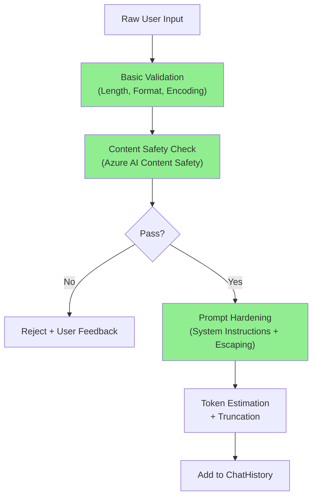

# AI - Question 17 - From a C# backend perspective, what patterns would you use to sanitize user inputs before they are injected into a ChatHistory object?

**From a C# backend perspective**, sanitizing user inputs before adding them to a `ChatHistory` object (in `Microsoft.Extensions.AI` or Semantic Kernel) is critical for security (prompt injection), safety (toxic/harmful content), and reliability (token limits, stability).

### Recommended Defense-in-Depth Patterns

1. **Input Validation & Normalization** (Fast, always-on)
2. **Content Safety Moderation** (Azure AI Content Safety or local alternatives)
3. **Prompt Injection Hardening**
4. **Length & Token Control**
5. **Logging & Auditing** (without storing raw PII)

**Sanitization Pipeline**


### Production-Ready Implementation
```csharp
using Microsoft.Extensions.AI;
using Azure.AI.ContentSafety; // Or equivalent

public class ChatHistorySanitizer
{
    private readonly ContentSafetyClient? _safetyClient;
    private readonly int _maxInputLength = 4000;
    private readonly int _maxTokens = 800;

    public ChatHistorySanitizer(ContentSafetyClient? safetyClient = null)
    {
        _safetyClient = safetyClient;
    }

    public async Task<ChatMessage> SanitizeAndCreateMessageAsync(
        string userInput, 
        ChatRole role = ChatRole.User,
        CancellationToken ct = default)
    {
        // 1. Basic validation
        if (string.IsNullOrWhiteSpace(userInput))
            throw new ArgumentException("Input cannot be empty.");

        if (userInput.Length > _maxInputLength)
            userInput = userInput[.._maxInputLength];

        // Normalize
        userInput = userInput.Trim().Replace("\r\n", "\n");

        // 2. Content Safety Moderation
        if (_safetyClient != null)
        {
            var request = new AnalyzeTextOptions(userInput);
            var response = await _safetyClient.AnalyzeTextAsync(request, ct);

            if (IsHarmfulContent(response))
            {
                throw new InvalidOperationException("Input violates safety policies.");
            }
        }

        // 3. Prompt Injection Defense
        userInput = HardenAgainstInjection(userInput);

        // 4. Optional: Token estimation + truncation
        userInput = TruncateToTokenLimit(userInput, _maxTokens);

        return new ChatMessage(role, userInput);
    }

    private static bool IsHarmfulContent(AnalyzeTextResult result)
    {
        // Example thresholds - tune based on your policy
        return result.HateResult?.Severity > ContentSeverityLevel.Medium ||
               result.SexualResult?.Severity > ContentSeverityLevel.Medium ||
               result.ViolenceResult?.Severity > ContentSeverityLevel.Medium ||
               result.SelfHarmResult?.Severity > ContentSeverityLevel.Medium;
    }

    private static string HardenAgainstInjection(string input)
    {
        // Simple but effective techniques
        return input
            .Replace("{", "{{")
            .Replace("}", "}}")
            .Replace("[", "[[")
            .Replace("]", "]]");
        // More advanced: use delimiters or system prompt instructions
    }

    private string TruncateToTokenLimit(string text, int maxTokens)
    {
        // Rough estimation (can use real tokenizer for precision)
        if (text.Length > maxTokens * 4)
            return text[..(maxTokens * 4)];

        return text;
    }
}
```

### Usage in Services
```csharp
public class RagChatService
{
    private readonly IChatClient _chatClient;
    private readonly ChatHistorySanitizer _sanitizer;

    public async Task<string> GetResponseAsync(string userMessage)
    {
        var sanitizedMessage = await _sanitizer.SanitizeAndCreateMessageAsync(userMessage);

        var history = new ChatHistory();
        history.AddSystemMessage("You are a helpful assistant..."); // Strong system prompt
        history.Add(sanitizedMessage);

        var response = await _chatClient.GetResponseAsync(history);
        return response.Message.Text ?? string.Empty;
    }
}
```

### Additional Recommended Patterns
- **Register as Scoped Service** in DI for easy testing and configuration.
- **Combine with Semantic Kernel**: Use `KernelFunction` attributes with input descriptions and validation.
- **Rate Limiting**: Apply per-user/IP limits before sanitization.
- **Audit Logging**: Log sanitized metadata (length, safety score) but not raw user input if sensitive.
- **Fallback**: Always have a "safe mode" that rejects high-risk inputs gracefully.

**Key Benefits**:
- Prevents prompt injection attacks
- Complies with responsible AI policies
- Maintains consistent token usage and cost control
- Keeps business logic clean and decoupled

This layered approach follows Microsoft security and responsible AI best practices for production .NET AI applications using `Microsoft.Extensions.AI` and Semantic Kernel. For the highest security, always combine technical controls with a strong system prompt and continuous monitoring. Refer to Azure AI Content Safety documentation for the latest moderation capabilities.