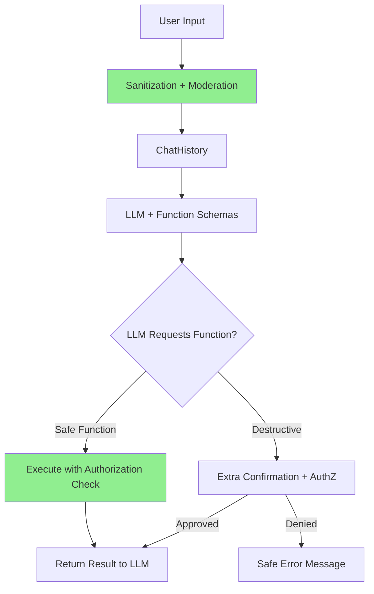

# AI - Question 18 - Explain the security implications of "Auto-Function Calling" in C#. How do you ensure the LLM doesn't execute a destructive DeleteDatabase(id) method?

**Auto-Function Calling** (also known as automatic tool invocation) in **Microsoft.Extensions.AI** and **Semantic Kernel** allows the LLM to dynamically select and execute registered C# functions (`[KernelFunction]`) to fulfill a user goal. While powerful for building agents, it introduces significant security risks if not carefully designed.

### Security Implications
- **Unintended / Malicious Execution**: An LLM can be tricked via **prompt injection** (direct or indirect) into calling destructive or sensitive functions.
- **Privilege Escalation**: If a destructive method like `DeleteDatabase(id)` is registered and visible to the model, the LLM might invoke it under adversarial prompts.
- **Data Exfiltration or Modification**: Functions with broad access (e.g., file system, database writes, external APIs) can be abused.
- **Denial of Service**: Loops calling expensive or resource-heavy functions.
- **Attack Surface Expansion**: Every exposed function becomes a potential tool for an attacker controlling the input (user messages, retrieved documents, etc.).

The core issue is that **the LLM is untrusted code** when it comes to function selection. Auto-invocation removes the human-in-the-loop for tool execution.

### How to Prevent Destructive Actions (e.g., DeleteDatabase)

**Best Practice: Least Privilege + Defense in Depth**

```csharp
// DANGEROUS - Avoid registering this directly if possible
public class DatabasePlugin
{
    [KernelFunction("DeleteDatabase")]
    [Description("Permanently deletes a database and all its data. Use with extreme caution.")]
    public async Task DeleteDatabaseAsync(string databaseId)
    {
        // This should be heavily guarded
        await DangerousDeleteOperation(databaseId);
    }
}
```

#### 1. **Selective Registration & Function Filtering**
Only register safe functions by default. Use `FunctionChoiceBehavior` to restrict what the model sees.

```csharp
var settings = new OpenAIPromptExecutionSettings
{
    FunctionChoiceBehavior = FunctionChoiceBehavior.Auto(
        functions: allowedFunctions,   // Explicit allowlist
        options: new FunctionChoiceBehaviorOptions { MaximumAutoInvokeAttempts = 5 })
};

// Or filter at plugin level
kernel.Plugins.AddFromType<SafeReadOnlyPlugin>();     // Safe functions only
// Do NOT add destructive plugins unless in admin context
```

#### 2. **Authorization Gates Inside Functions**
Never trust the LLM — always re-validate permissions inside the C# method.

```csharp
[KernelFunction("DeleteDatabase")]
public async Task<string> DeleteDatabaseAsync(string databaseId, Kernel kernel)
{
    // Critical: Re-authorize based on current user context
    var userContext = kernel.GetRequiredService<IUserContext>();
    if (!userContext.CanDeleteDatabase(databaseId))
        throw new UnauthorizedAccessException("Insufficient permissions to delete database.");

    // Optional: Require human confirmation for destructive actions
    if (!await _confirmationService.RequestConfirmationAsync($"Delete database {databaseId}?"))
        return "Operation cancelled by user.";

    await PerformDelete(databaseId);
    return "Database deleted successfully.";
}
```

#### 3. **Separate Plugins by Sensitivity**
- `ReadOnlyPlugins` → Always available.
- `WritePlugins` / `DestructivePlugins` → Only registered for privileged sessions or after explicit user confirmation.

#### 4. **Additional Hardening Techniques**
- **Strong System Prompt**: Instruct the model clearly about when *not* to call destructive functions.
- **Input Sanitization**: Validate and moderate all user input before adding to `ChatHistory`.
- **Maximum Invocation Limits**: Set `MaximumAutoInvokeAttempts` to prevent runaway loops.
- **Auditing & Logging**: Log every function call with user ID, arguments, and outcome.
- **Sandboxing**: Run destructive operations in isolated scopes or with reduced privileges.

**Secure Function Calling Flow**


### Summary of Recommended Architecture
- Register the **minimum** set of functions needed for the current context.
- Implement **defense-in-depth** inside every sensitive `KernelFunction`.
- Use explicit **allowlists** and `FunctionChoiceBehavior` filters.
- Add **human-in-the-loop** for high-impact actions.
- Monitor and audit all invocations.

This approach aligns with Microsoft’s guidance on AI agent security and the principle of least privilege. Auto-function calling is safe and effective only when the functions themselves are designed with security as a first-class concern. For the latest patterns, refer to the official Semantic Kernel documentation on function calling and Microsoft’s AI security benchmarks.