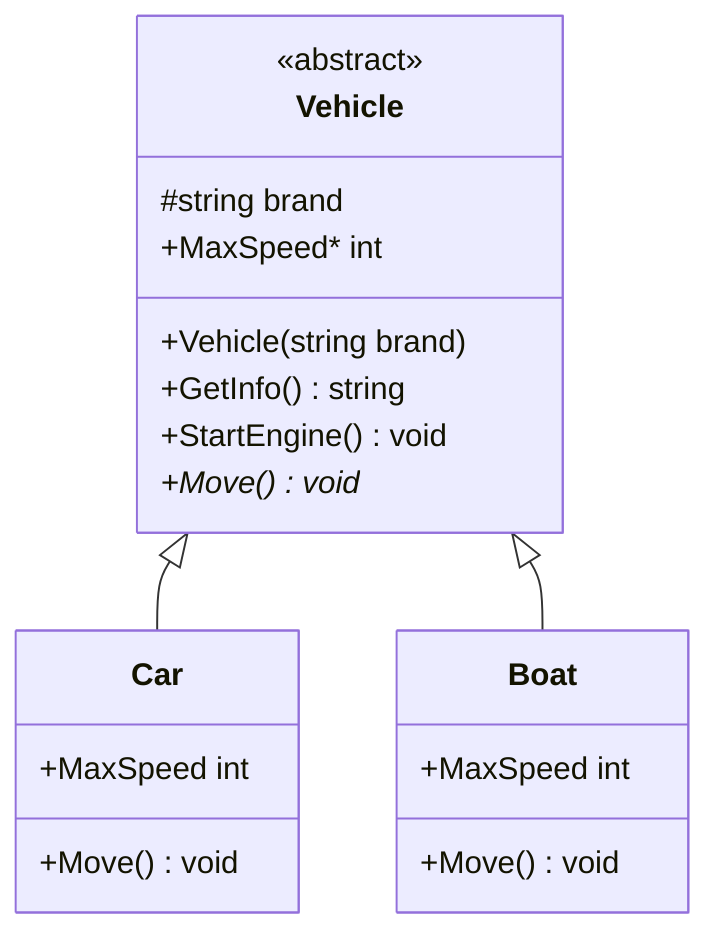

# Question 7 - Inheritance

## What is an abstract class in C# and how does it differ from a regular class?


**An abstract class is an incomplete class that exists only to be inherited.** You cannot create an instance of it with `new`. A regular (concrete) class is complete: you can instantiate it and use it as-is.

Think of a regular class as a finished blueprint you can build from immediately. An abstract class is a partial blueprint that says “every building of this type must have these rooms and this wiring, but the exact layout of the rooms is left to each specific building.”

### Core difference at a glance

| Feature | Regular class | Abstract class |
|---|---|---|
| Instantiation | `new MyClass()` is allowed | Compile error (`CS0144`) |
| Purpose | Standalone type or optional base | Base/template only |
| Abstract members | Not allowed | Allowed (methods, properties, indexers, events) |
| Implemented members | Allowed | Allowed (methods, properties, fields, constructors) |
| Must be inherited? | No | Intended to be (cannot be `sealed`) |
| Derived class duty | Optional `virtual` overrides | Must `override` every abstract member, or stay abstract |

An abstract class can have **zero** abstract members. Marking it `abstract` simply means “this concept should never be instantiated by itself” (e.g. `Publication`, `Shape`, `Vehicle`).

### Visual hierarchy



`*` marks members that derived classes **must** implement. Shared state and behavior live on `Vehicle`; type-specific behavior lives on `Car` and `Boat`.

### Complete example

```csharp
public abstract class Vehicle
{
    protected string Brand { get; }

    // Abstract classes can have constructors (usually protected).
    // Derived classes must call them with : base(...)
    protected Vehicle(string brand)
    {
        Brand = brand;
    }

    // Concrete (implemented) members — inherited as-is
    public string GetInfo() => $"This is a {Brand} vehicle.";

    public virtual void StartEngine() =>
        Console.WriteLine($"{Brand} engine is starting...");

    // Abstract members — no body; derived classes must override
    public abstract void Move();
    public abstract int MaxSpeed { get; }
}

public class Car : Vehicle
{
    public Car(string brand) : base(brand) { }

    public override void Move() =>
        Console.WriteLine($"{Brand} car is driving on the road.");

    public override int MaxSpeed => 200;
}

public class Boat : Vehicle
{
    public Boat(string brand) : base(brand) { }

    public override void Move() =>
        Console.WriteLine($"{Brand} boat is sailing on the water.");

    public override int MaxSpeed => 50;
}
```

Usage:

```csharp
// Vehicle v = new Vehicle("Generic"); // compile error

Vehicle car  = new Car("Toyota");
Vehicle boat = new Boat("Yamaha");

Console.WriteLine(car.GetInfo());
car.StartEngine();
car.Move();
Console.WriteLine($"Max speed: {car.MaxSpeed}");
```

Polymorphism works because the variable type can be the abstract base while the actual object is a concrete derived type. Calls to `Move()` and `MaxSpeed` dispatch to the derived implementation.

### Rules that trip people up

- Abstract members are **implicitly virtual**. You implement them with `override`, not `new`.
- A non-abstract derived class must implement **every** inherited abstract member. If it does not, it must itself be marked `abstract`.
- You can have an inheritance chain of abstract classes; only the first concrete class has to fill in all remaining abstract members.
- Abstract classes **can** have fields, constructors, and fully implemented methods. That is the main reason to choose a class over an interface when types share state or default behavior.
- `abstract` and `sealed` cannot be combined. One requires inheritance; the other forbids it.
- Abstract members cannot be `static` on a class (interfaces can have `static abstract` members in modern C#).

### When to use which

Use a **regular class** when the type is a complete concept you actually want to create (`User`, `Order`, `HttpClient`).

Use an **abstract class** when:

- Instantiating the base type would be meaningless (“a generic Shape” or “a generic Publication”).
- Related types share both a contract **and** implementation or state (constructor logic, fields, helper methods).
- You want an “is-a” hierarchy and will only ever have one such base class (C# allows only single class inheritance).

If you only need a contract and no shared state or implementation, an **interface** is usually the better fit. Abstract class = shared identity + optional shared code. Interface = capability (“can do X”). You can combine them: inherit one abstract class and implement many interfaces.

