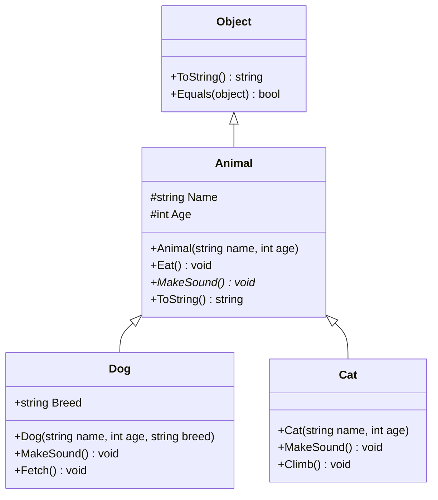

# Question 8 - Inheritance

## Can you give an example of how to use inheritance to create a hierarchy of classes in C#?

Inheritance models an “is-a” family of types. The base class holds the data and behavior every member of the family shares. Each derived class reuses that foundation, then adds or specializes only what is unique to it.In C# a class can inherit from exactly one other class. That is single inheritance. Every class also inherits from System.Object, so members such as ToString() and Equals() are available even if you never declare them. 

### The hierarchy



`Dog` **is an** `Animal`. `Cat` **is an** `Animal`. Both therefore **are** `Object`s as well. Inheritance is transitive.

### The code

```csharp
public class Animal
{
    // protected: visible to this class and derived classes, not to outside code
    public string Name { get; }
    public int Age { get; }

    public Animal(string name, int age)
    {
        Name = name;
        Age = age;
    }

    // Shared behavior — every animal eats the same way here
    public void Eat() => Console.WriteLine($"{Name} is eating.");

    // virtual: derived classes MAY replace this implementation
    public virtual void MakeSound() =>
        Console.WriteLine($"{Name} makes a generic animal sound.");

    public override string ToString() => $"{Name} ({Age} years)";
}

public class Dog : Animal
{
    public string Breed { get; }

    // Constructors are NOT inherited. Call the base constructor explicitly.
    public Dog(string name, int age, string breed) : base(name, age)
    {
        Breed = breed;
    }

    public override void MakeSound() =>
        Console.WriteLine($"{Name} barks.");

    // Dog-only behavior
    public void Fetch() => Console.WriteLine($"{Name} fetches the ball.");
}

public class Cat : Animal
{
    public Cat(string name, int age) : base(name, age) { }

    public override void MakeSound() =>
        Console.WriteLine($"{Name} meows.");

    public void Climb() => Console.WriteLine($"{Name} climbs the furniture.");
}
```

What each derived class gets:

| Comes from `Animal` | Added by the derived class |
|---|---|
| `Name`, `Age`, constructor initialization | `Breed` (`Dog` only) |
| `Eat()` | `Fetch()` / `Climb()` |
| default `MakeSound()` (replaced via `override`) | specialized sound |
| `ToString()` | — |

### Using the hierarchy

```csharp
var dog = new Dog("Fido", 3, "Labrador");
var cat = new Cat("Fluffy", 2);

dog.Eat();       // inherited
dog.MakeSound(); // overridden → "Fido barks."
dog.Fetch();     // Dog-only

cat.Eat();
cat.MakeSound(); // overridden → "Fluffy meows."
cat.Climb();
```

The important part the original snippet never showed: **treat different animals as the same type**.

```csharp
Animal[] zoo = { dog, cat, new Dog("Rex", 5, "German Shepherd") };

foreach (Animal animal in zoo)
{
    Console.WriteLine(animal); // ToString from Animal
    animal.Eat();
    animal.MakeSound();        // runtime picks Dog or Cat version
    // animal.Fetch();         // compile error — Animal does not have Fetch
}
```

Output for the first two items:

```
Fido (3 years)
Fido is eating.
Fido barks.
Fluffy (2 years)
Fluffy is eating.
Fluffy meows.
```

That last loop is the reason inheritance exists. The compiler knows every item is an `Animal`, so `Eat()` and `MakeSound()` are legal. At runtime, `MakeSound()` runs the **actual** type’s override (`Dog` or `Cat`). That is polymorphism. It only works if the base member is `virtual` (or `abstract`) and the derived member uses `override`. Without those keywords you only hide the method, and a base-type variable still calls the base version.

### Rules that matter in a hierarchy

- **Constructors are not inherited.** Each class defines its own. If the base has no parameterless constructor, the derived constructor must call `: base(...)`.
- **`private` members are not usable in the derived class.** Use `protected` for state derived types should see.
- **`virtual` = optional specialization. `abstract` = required specialization.** If `MakeSound()` were `abstract`, `Animal` itself could not be instantiated and every concrete animal would have to override it.
- You cannot increase access when overriding (`protected` cannot become `public` in a way that breaks the original contract rules), and you cannot override a non-virtual member.
- A later class can keep extending the chain (`GuardDog : Dog`) unless someone marks a class `sealed`.
- Structs cannot inherit from a class.

### When this design is the right one

Use a class hierarchy when the relationship is genuinely **is-a** and types share both data and behavior: a dog is an animal, a book is a publication, a circle is a shape.

Do **not** use inheritance just to reuse a couple of methods. If a `Car` “has an” engine rather than “is an” engine, prefer composition (`Car` contains an `Engine`). If you only need a capability with no shared state, prefer an interface (`IMakeSound`).
