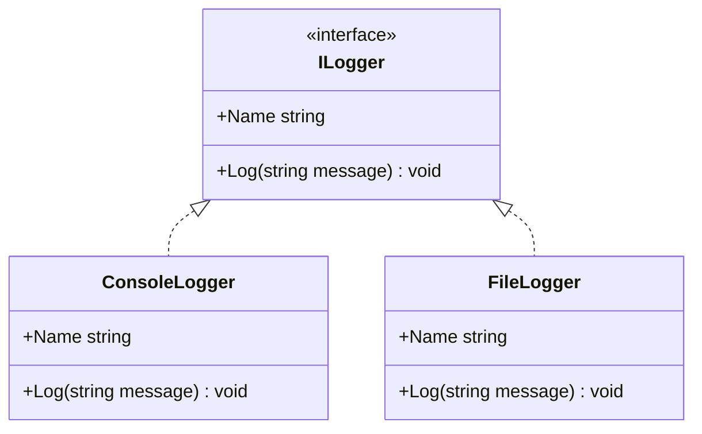

# Question 9 - Inheritance

## What is an interface in C# and how is it related to inheritance?

**An interface is a contract.** It names the members a type must provide so other code can depend on *capability*, not on a specific class. A class, record, or struct that implements the interface supplies the actual behavior. You cannot create an interface with `new`.

Inheritance answers “what this type **is**.” An interface answers “what this type **can do**.” That distinction matters in C# because a class can inherit from only one other class, but it can implement many interfaces. Structs cannot inherit from a class at all, so an interface is how a value type joins a shared contract.

### What an interface can declare

A modern C# interface can include methods, properties, indexers, events, constants, operators, nested types, and static members. It cannot hold instance fields or instance constructors. Members without a body are abstract and public by default. Members with a body are default implementations: implementing types may use them as-is or replace them.



The dashed line is *implements*, not *inherits*. `ConsoleLogger` is not a kind of `ILogger` in the class-hierarchy sense. It promises to satisfy the `ILogger` contract.

### A contract and two implementations

```csharp
public interface ILogger
{
    string Name { get; }
    void Log(string message);
}

public class ConsoleLogger : ILogger
{
    public string Name => "Console";

    public void Log(string message) =>
        Console.WriteLine($"[{Name}] {message}");
}

public class FileLogger : ILogger
{
    public string Name => "File";

    public void Log(string message) =>
        Console.WriteLine($"[{Name}] Writing to file: {message}");
}
```

Callers program to the interface:

```csharp
void WriteStartup(ILogger logger)
{
    logger.Log("Application started");
}

WriteStartup(new ConsoleLogger());
WriteStartup(new FileLogger());
```

`WriteStartup` does not know or care which class arrived. It only needs `Log`. That is the flexibility interfaces exist for: swap implementations without changing the consuming code.

### Multiple interfaces, plus a base class

A class can reuse one base type **and** take on several contracts. When both appear in the declaration, the class comes first:

```csharp
public abstract class Notification
{
    public string Recipient { get; }

    protected Notification(string recipient) => Recipient = recipient;

    public void LogAttempt() =>
        Console.WriteLine($"Notifying {Recipient}");

    public abstract Task SendAsync();
}

public interface IRetryable
{
    int MaxAttempts { get; }
}

public interface IPrioritized
{
    int Priority { get; }
}

public class EmailNotification : Notification, IRetryable, IPrioritized
{
    public EmailNotification(string recipient) : base(recipient) { }

    public int MaxAttempts => 3;
    public int Priority => 1;

    public override Task SendAsync()
    {
        LogAttempt();
        Console.WriteLine($"Email sent to {Recipient}");
        return Task.CompletedTask;
    }
}
```

`EmailNotification` **is a** `Notification` (shared state, constructor, `LogAttempt`, required `SendAsync`). It **can be retried** and **can be prioritized** because it implements those interfaces. Code that only needs retry policy can accept `IRetryable` and never mention email.

### Interfaces can form their own hierarchy

```csharp
public interface IDrawable
{
    void Draw();
}

public interface IShape : IDrawable
{
    double Area { get; }
}

public class Circle : IShape
{
    public Circle(double radius) => Radius = radius;

    public double Radius { get; }
    public double Area => Math.PI * Radius * Radius;

    public void Draw() =>
        Console.WriteLine($"Drawing circle, area {Area:F2}");
}
```

A `Circle` can be used as `IShape` or as `IDrawable`. Implementing `IShape` includes the members of `IDrawable`.

### Explicit implementation

When two interfaces declare the same member, or when you do not want the member on the class’s public surface, implement it explicitly. The method is then reachable only through the interface type:

```csharp
public interface IMetric { double GetDistance(); }
public interface IImperial { double GetDistance(); }

public class Runway : IMetric, IImperial
{
    private readonly double _meters;
    public Runway(double meters) => _meters = meters;

    double IMetric.GetDistance() => _meters;
    double IImperial.GetDistance() => _meters * 3.28084;
}

var runway = new Runway(100);
// runway.GetDistance();                 // does not compile
double meters = ((IMetric)runway).GetDistance();
double feet   = ((IImperial)runway).GetDistance();
```

### Interface vs class inheritance

| | Class inheritance | Interface |
|---|---|---|
| Relationship | “is-a” | “can-do” |
| How many | One base class | Many interfaces |
| Shared state | Fields, constructors | No instance fields |
| Shared code | Implemented methods | Optional default members |
| Who can use it | Classes, records | Classes, records, **and structs** |
| Instantiation | Concrete classes yes | Never |
| Access to members | Through the class or base type | Through the interface (and through the class if implemented implicitly) |

Use a **class hierarchy** when types share identity and state: `Dog` is an `Animal`, `Book` is a `Publication`. Use an **interface** when unrelated types share a capability: a `File`, a `NetworkStream`, and a `MemoryStream` can all be `IDisposable`. Use **both** when a type already has a parent and still needs extra contracts.

Default interface members (C# 8+) let you add a method body to an interface so existing implementers do not immediately break. Static abstract members (C# 11+) let an interface require operators or factories on the implementing type itself, which is how numeric generic math works. Those features extend the contract model; they do not turn an interface into a class. An interface still has no per-instance field to store state.

Design around interfaces when you want callers to depend on a small, stable capability. Keep each interface focused. Combine that contract with class inheritance only when there is a genuine shared base underneath.